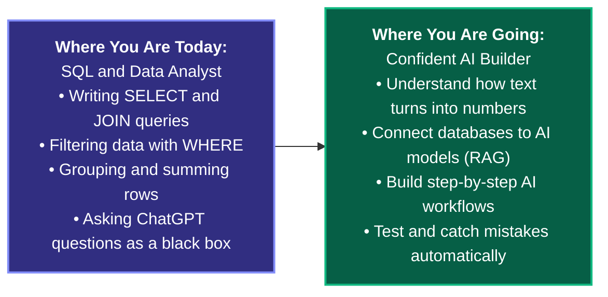
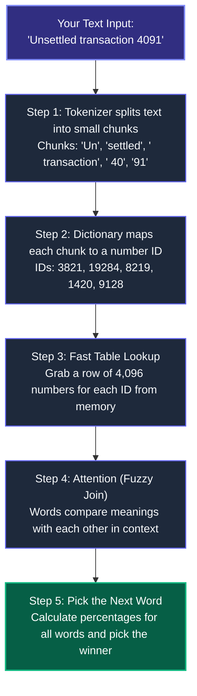
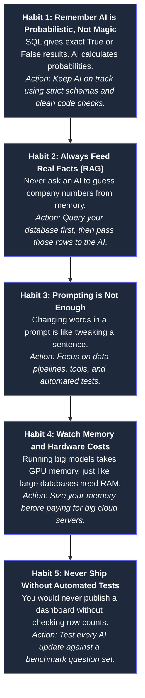

# CHAPTER 0: The SQL-to-AI Guide: Zero-to-One for Beginners

## 0.1 Welcome: You Already Know More AI Than You Think

If you know how to write a simple SQL `SELECT` query, join two tables, or look up an ID, you already understand the most important ideas in AI.

People in tech often make AI sound like magic. They use big, fancy words like "latent manifolds", "tensor contractions", or "attention matrices". These words make deep learning sound like rocket science.

It is not rocket science. Underneath all the jargon, an AI model is just a fast calculator running on numbers stored in tables.



### What You Will Understand When You Finish This Guide:
1. **How AI Actually Works:** You will know what happens to words from the moment a user types them in, to the exact math the computer does to answer back.
2. **How to Connect AI to Real Data:** You will learn how to feed real database rows into an AI model so it never has to guess or make things up (this is called RAG).
3. **How to Build Helpful AI Workers:** You will learn how to let an AI use real tools, like running a SQL query or calculating a math formula, with a human checking its work.
4. **How to Test AI Output:** You will learn how to automatically grade AI answers for accuracy before users see them, just like running quality tests on a database.

---

## 0.2 The Rosetta Stone: Matching SQL Words to AI Words

Every main piece of a modern AI model matches a database idea you probably already know. Here is the translation table:

| Everyday SQL and Database Idea | AI and Machine Learning Term | What Is Actually Happening Under the Hood? |
|---|---|---|
| **SQL Table / Spreadsheet** | **2D Matrix / Tensor** | A grid of numbers with rows and columns saved in computer memory. |
| **Row ID (`customer_id = 4091`)** | **Token ID (`3821`)** | A number that stands for a specific word piece in a dictionary list. |
| **Lookup by ID (`SELECT * WHERE id = 3821`)** | **Embedding Lookup ($W_E$)** | The computer jumps directly to row 3821 in memory to grab its list of numbers. |
| **Joining Two Tables (`Table A JOIN Table B`)** | **Attention Mechanism** | Words compare themselves to other words in the sentence to figure out the context. |
| **`GROUP BY` and `SUM()`** | **Softmax and Value Mix ($P \times V$)** | Turning match scores into percentages that add up to 100%, then taking a weighted average. |
| **Table Rules (`NOT NULL`, column types)** | **Pydantic Schema** | Making sure the AI returns clean data with the exact fields and formats you asked for. |
| **Stored Procedure / Database Function** | **AI Tool Call** | Running regular Python or SQL code when the AI decides it needs fresh data or exact math. |
| **Read-Only Database Replica** | **Inference Engine (vLLM)** | A fast, read-only setup that serves answers to many users at the same time without slowing down. |
| **Index Scan vs Full Table Scan** | **Prompt Reading vs Token Generation** | Reading your initial question is done in one big pass; answering happens one word at a time. |
| **`WHERE` Filter and Access Rules (RLS)** | **Guardrails and Safety Filters** | Checking inputs and outputs to block bad instructions, passwords, or personal info. |
| **Automated Data Quality Tests (`dbt test`)** | **Evals (Evaluation Suite)** | Running automated tests to check if the AI answered accurately and stuck to the facts. |

---

## 0.3 Step by Step: How an AI Reads and Answers

Let us follow what happens when you type the sentence: `"Unsettled transaction 4091"`.



### Step 1: Tokenizing is Just an ID Lookup
Computers do not read letters or sentences like humans. They only know numbers.

Before an AI can read your message, it cuts your text into small word pieces called **tokens**. Then it checks a dictionary to get the number ID for each piece.

Think of it like this SQL query:

```sql
-- What tokenizing looks like in SQL terms:
SELECT token_id, token_string 
FROM word_dictionary 
WHERE token_string IN ('Un', 'settled', ' transaction', ' 40', '91');
-- This gives back a list of IDs: [3821, 19284, 8219, 1420, 9128]
```

### Step 2: Embeddings are Just Rows in a Big Table
Once the computer has the number IDs, it looks up each ID in a giant table called an **Embedding Table ($W_E$)**.

This table has around 128,000 rows (one row for every word piece) and 4,096 columns (numbers that describe what the word means).

```sql
-- What an embedding lookup looks like in SQL terms:
SELECT col_1, col_2, col_3, ..., col_4096 
FROM embedding_table 
WHERE token_id = 3821;
```

In computer chips, this does not require any slow searching. The computer just jumps straight to the right byte address in memory:

$$\text{Memory Address} = \text{Start Address} + (\text{token\_id} \times 4096 \times 2 \text{ bytes})$$

### Step 3: Attention is Like a Fuzzy Self-Join
Why do we need attention? Because one word can mean completely different things depending on the words around it.

For example, think about the word **"bank"**:
- *"I deposited money in the bank."* (a financial company)
- *"We sat by the river bank."* (the edge of a river)

If you only looked up the word "bank" in a static dictionary, the computer could not tell the difference.

**Attention** solves this. It lets every word look at the other words in the sentence and update its meaning. It is like running a SQL self-join:

```sql
-- How Attention acts like a SQL Join:
SELECT 
    q.token_id AS current_word,
    k.token_id AS context_word,
    -- Check how closely the two words relate to each other:
    (q.vector <#> k.vector) / 11.3 AS connection_strength,
    v.info_vector
FROM sentence_words q
CROSS JOIN sentence_words k
JOIN sentence_words v ON k.token_id = v.token_id
WHERE k.word_position <= q.word_position; -- You cannot look ahead to future words!
```

After comparing the words, the AI normalizes the scores into percentages that add up to 100%. Then it combines the word meanings. Now "bank" knows it is next to "money", so it means a financial bank!

---

## 0.4 Why Traditional SQL Needs AI (and Why AI Needs SQL)

As an analyst, you are used to writing exact queries:

```sql
SELECT customer_id, amount 
FROM transactions 
WHERE status = 'FLAGGED' AND amount > 5000;
```

This works great when your data is neat and tidy. But what happens when your manager asks you:

> *"Did the customer sound unhappy about unexplained fees in their dispute email?"*

If you try to write a SQL query for that:

```sql
SELECT * FROM emails 
WHERE body_text LIKE '%unhappy%' 
   OR body_text LIKE '%unexplained fees%';
```

This simple query fails in three big ways:
1. **Different Words:** The customer might write *"I am totally fed up with these hidden charges"*. They never used the word "unhappy" or "unexplained fees", so SQL returns **0 rows**.
2. **Wrong Context:** An email might say *"I am happy that the unexplained fee was refunded"*. SQL sees the keywords and flags it, even though the customer is satisfied!
3. **Math and Policy Rules:** SQL `LIKE` queries cannot check if $\$14.20 - \$12.80 = \$1.40$ is bigger than the allowable policy threshold.

**This is why AI exists:** to understand messy human language. And **this is why SQL exists:** to store facts, calculate exact numbers, and keep track of ground truth. 

When you combine both, you get reliable, powerful systems.

---

## 0.5 Five Simple Habits for Beginners



---

## 0.6 How to Walk Through This Course

Each chapter in this handbook builds one clear step on top of the last:

```mermaid
flowchart TD
    Ch0["<b>Chapter 0 (You Are Here):</b><br/>The SQL-to-AI Beginner Translation Guide"]
    --> Ch1["<b>Chapter 1: The Mechanical Foundation</b><br/>How computers store numbers, split words, and map meanings"]
    --> Ch2["<b>Chapter 2: The Attention Engine</b><br/>How words connect with context and how memory is sized"]
    --> Ch3["<b>Chapter 3: Fine-Tuning and Adapting</b><br/>Teaching an open-source model custom company data with LoRA"]
    --> Ch4["<b>Chapter 4: Production Search and RAG</b><br/>Combining keyword search (BM25) with vector search (pgvector)"]
    --> Ch5["<b>Chapter 5: Step-by-Step AI Workers</b><br/>Building multi-step flows with safe tools and human approval buttons"]
    --> Ch6["<b>Chapter 6: Serving and Scaling</b><br/>Running models efficiently for many users at the same time (vLLM)"]
    --> Ch7["<b>Chapter 7: Testing, Safety and Rules</b><br/>Catching mistakes automatically and following safety standards"]
    --> Ch8["<b>Chapter 8: The Complete Capstone Project</b><br/>A full financial auditor that reads filings and flags issues"]
    --> Ch9["<b>Chapter 9: The 60-Day Study Plan</b><br/>A day-by-day practical learning sprint for busy people"]
    --> Ch10["<b>Chapter 10: Building Real Projects for Your Portfolio</b><br/>How to showcase real working code and explain design choices"]

    classDef default fill:#1e293b,stroke:#6366f1,stroke-width:1.5px,color:#f8fafc;
    classDef current fill:#312e81,stroke:#818cf8,stroke-width:2px,color:#ffffff;
    class Ch0 current;
```



You already have the foundation. You know tables, queries, filters, and schemas. Now let us turn that knowledge into practical AI skills.
