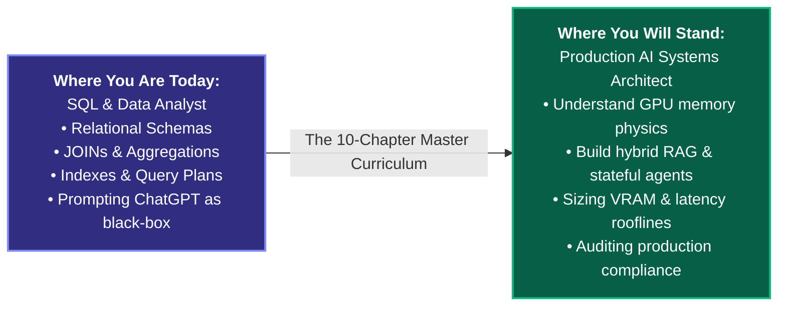
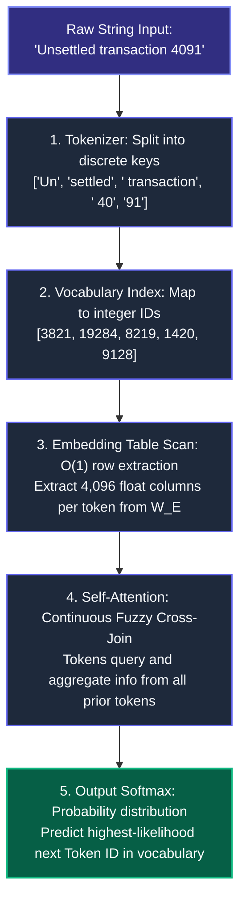
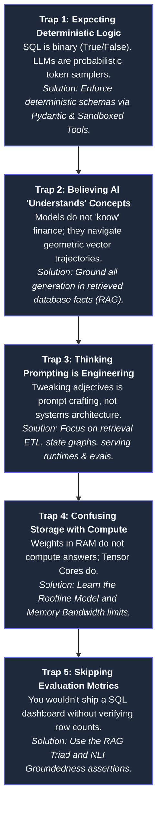

# CHAPTER 0: The SQL-to-AI Rosetta Stone — Zero-to-One Foundations for Analysts

## 0.1 Executive Welcome: Your Transformation from Analyst to AI Systems Architect

If you know how to write a `SELECT` statement, execute a `JOIN`, inspect a query plan, or diagnose a slow index, **you already possess 70% of the cognitive framework needed to master Artificial Intelligence**.

The AI industry is blanketed in mystical jargon—*"latent manifolds", "attention sinks", "tensor contractions", "hallucination filters"*. These terms make deep learning feel like black magic. 

**It is not magic. It is data engineering and linear algebra executed at scale.**



### What You Will Understand After Completing This Handbook:
1. **The Physical Mechanics:** You will know exactly what happens to a string of text from the moment a user presses enter to the nanosecond a GPU generates the next token.
2. **Hardware & Economics:** You will be able to calculate the exact VRAM overhead and server costs required to host a model for 50 concurrent users *before* spending a single dollar on cloud compute.
3. **Retrieval & Agents:** You will build hybrid retrieval systems fusing vector graphs with lexical search, and orchestrate autonomous state graphs with human approval gates.
4. **Safety & Governance:** You will implement continuous evaluation pipelines (the RAG Triad), adversarial delimiter sandboxes, and documentation compliant with the **EU AI Act**.

---

## 0.2 The SQL-to-AI Rosetta Stone: Universal Concept Translation

Every major component of a Large Language Model maps directly to a relational database primitive you already use every day:

| Relational Database / SQL Concept | AI & LLM Runtime Equivalent | What Is Physically Happening in Hardware? |
|---|---|---|
| **SQL Table** | **2D Matrix / Tensor ($S \times d$)** | A contiguous memory buffer of rows (tokens) and columns (dimensions). |
| **Row Primary Key (`id`)** | **Token ID (e.g., `3821`)** | An integer index pointing to a discrete sub-word entry in a vocabulary table. |
| **Indexed Primary Key Lookup (`SELECT * FROM table WHERE id = X`)** | **Embedding Layer ($W_E$)** | An $O(1)$ memory pointer jump to extract a 4,096-column feature vector from RAM. |
| **Fuzzy Self-Join (`table A JOIN table B ON similarity`)** | **Self-Attention Mechanism** | Multiplying Query vectors by Transposed Key vectors to compute relational affinity scores. |
| **`GROUP BY` + `SUM()` Aggregate Function** | **Softmax Normalization & Value Projection ($P \times V$)** | Normalizing match scores to sum to 1.0 (probabilities) and taking a weighted average of values. |
| **Fixed Schema Definition (`CREATE TABLE`)** | **Pydantic Data Contracts** | Enforcing strict JSON type safety and regex validation on model inputs and tool outputs. |
| **Stored Procedure / Database Trigger** | **Agentic Tool Execution** | A deterministic function executed outside the model when a specific state trigger is met. |
| **Database Read-Replica Pool** | **Inference Engine Cluster (vLLM)** | Read-only serving instances configured for high concurrency without state corruption. |
| **Query Execution Plan & Buffer Pool** | **Inference Prefill vs. Decode Phase & KV Cache** | Prefill is compute-bound (reading prompt); Decode is memory-bound (loading past KV states). |
| **`WHERE` Filter & Row-Level Security (RLS)** | **Input/Output Guardrail Gateway** | Intercepting unauthorized prompt injections or sensitive data (SSNs/PII) at system boundaries. |
| **Unit Test Suite & Data Quality Checks (`dbt test`)** | **The RAG Triad (Evals Suite)** | Automatically verifying Context Relevance, Groundedness (NLI), and Answer Relevance. |

---

## 0.3 The Journey of a Data Row: From Text to Neural Activation

Let us trace how text flows through an AI model using relational SQL terms.



### 1. Tokenization is Foreign Key Resolution
When you submit a text string, the computer does not read words or letters. It uses a **Tokenizer**—which is essentially a pre-compiled lookup catalog mapping text fragments to integer primary keys:

```sql
-- Conceptual SQL equivalent of Tokenization:
SELECT token_id, token_string 
FROM vocabulary_catalog 
WHERE token_string IN ('Un', 'settled', ' transaction', ' 40', '91');
-- Returns: [3821, 19284, 8219, 1420, 9128]
```

### 2. The Embedding Matrix is a Materialized View
Once the system has the token IDs, it retrieves their vector representations from the **Embedding Matrix ($W_E$)**. 
An embedding matrix is simply a table with 128,000 rows (vocabulary size) and 4,096 columns (hidden dimension):

```sql
-- Conceptual SQL equivalent of Embedding Lookup:
SELECT col_1, col_2, ..., col_4096 
FROM embedding_weights_table 
WHERE token_id = 3821;
```

In hardware, this is not an expensive join; it is a **single-cycle direct memory pointer offset**:
$$\text{Memory Address} = \text{Base Address} + (\text{token\_id} \times 4096 \times 2 \text{ bytes})$$

### 3. Self-Attention is a Continuous, Weighted Self-JOIN
Why do we need attention? Because static embeddings cannot distinguish between *"bank account"* and *"river bank"*.
Self-attention takes the token sequence and executes a continuous, fuzzy cross-join where each token queries every preceding token to update its meaning:

```sql
-- Conceptual SQL equivalent of Self-Attention:
SELECT 
    q.token_id AS query_token,
    k.token_id AS key_token,
    -- Compute alignment score (Query dot Key):
    (q.vector <#> k.vector) / SQRT(128) AS raw_affinity,
    v.payload_vector
FROM prompt_tokens q
CROSS JOIN prompt_tokens k
JOIN prompt_tokens v ON k.token_id = v.token_id
WHERE k.position_index <= q.position_index; -- Causal Masking (cannot look ahead)
```

The resulting affinity scores are passed into a Softmax function (which normalizes them so the percentages sum to $100\%$), and used to compute a weighted average of the value vectors ($V$).

---

## 0.4 Why Traditional SQL Fails on Unstructured Text

As an analyst, you are accustomed to querying structured tables:
```sql
SELECT customer_id, transaction_amount 
FROM transactions 
WHERE status = 'FLAGGED' AND amount > 5000;
```
This query is fast and deterministic because the database engine uses B-Tree indexes on structured columns.

### The Semantic Gap:
What happens when you need to answer:
> *"Did the merchant report any unexplained variance in their Q3 dispute reserves?"*

In traditional SQL, you would try:
```sql
SELECT * FROM document_filings 
WHERE body_text LIKE '%dispute reserve%' 
   OR body_text LIKE '%unexplained variance%';
```
This naive lexical search breaks in production:
1. **Synonym Blindness:** The filing might say *"chargeback remediation provisions shifted unexpectedly by €1.8M"*. The words "dispute reserve" and "unexplained variance" appear nowhere in the text, so the SQL query returns **0 rows**.
2. **Context Blindness:** A document matching the keyword *"variance"* might be discussing *"variance in climate emissions"*, returning completely irrelevant noise.
3. **No Numerical Reasoning:** SQL `LIKE` patterns cannot verify whether $\$14.2\text{M} - \$12.8\text{M} = \$1.4\text{M}$ represents a material reporting breach under regulatory guidelines.

**This is the reason AI exists:** to bridge the gap between human language nuances and structured data calculations.

---

## 0.5 The Five Mental Traps SQL Analysts Face When Learning AI



---

## 0.6 How to Navigate This 10-Chapter Master Curriculum

Each module in this handbook builds upon the last, transforming your relational foundations into full-stack AI engineering capability:

```mermaid
flowchart TD
    Ch0["<b>Chapter 0 (You Are Here):</b><br/>The SQL-to-AI Rosetta Stone & Mental Models"]
    --> Ch1["<b>Chapter 1: The Mechanical Foundation</b><br/>Tensors, memory strides, BPE tokenizers & latent vector geometry"]
    --> Ch2["<b>Chapter 2: The Attention Engine</b><br/>Projections (Q, K, V), Scaled Dot-Product math & KV-Cache sizing"]
    --> Ch3["<b>Chapter 3: Adaptation & Fine-Tuning</b><br/>AdamW 16-byte memory wall, LoRA decomposition (W0 + BA) & DPO alignment"]
    --> Ch4["<b>Chapter 4: Production Hybrid RAG</b><br/>pgvector HNSW, PostgreSQL BM25 Full-Text & Reciprocal Rank Fusion"]
    --> Ch5["<b>Chapter 5: Stateful Agent Graphs</b><br/>LangGraph cyclic state machines, Pydantic tools & Human-in-the-Loop gates"]
    --> Ch6["<b>Chapter 6: High-Throughput Serving</b><br/>vLLM, PagedAttention virtual memory & Roofline latency models"]
    --> Ch7["<b>Chapter 7: Evals, Security & Governance</b><br/>The RAG Triad, NLI hallucination audits & EU AI Act compliance"]
    --> Ch8["<b>Chapter 8: The Production Capstone</b><br/>Autonomous Financial Risk & Compliance Auditor complete architecture"]
    --> Ch9["<b>Chapter 9: The 60-Day Hyper-Sprint</b><br/>The 30-60-30 deliberate practice protocol & 4 gate milestones"]
    --> Ch10["<b>Chapter 10: The Portfolio Playbook</b><br/>4 Tier-1 GitHub artifacts, Incident Post-Mortems (RCA) & Whiteboard defense"]

    classDef default fill:#1e293b,stroke:#6366f1,stroke-width:1.5px,color:#f8fafc;
    classDef current fill:#312e81,stroke:#818cf8,stroke-width:2px,color:#ffffff;
    class Ch0 current;
```



You are not starting from zero. You already think in tables, schemas, relations, and indexes. Now, let us step into Chapter 1 and build your first neural tensor from scratch.
