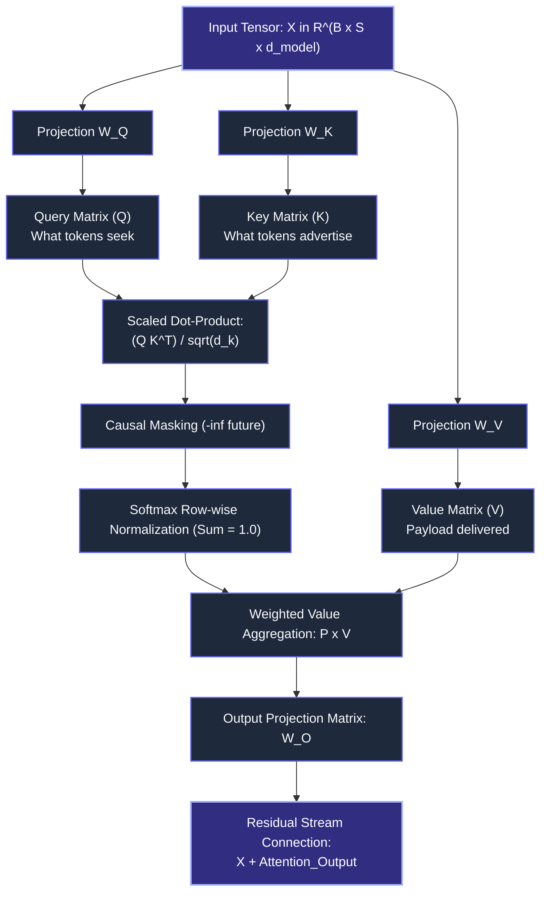

# CHAPTER 2: The Attention Engine: Projections, Scaled Dot-Product, GQA and KV-Cache Sizing

## 2.1 Architectural Overview & Layer Scope

In Chapter 1, we established how raw text is converted into a structured input tensor $X \in \mathbb{R}^{B \times S \times d_{\text{model}}}$. 

However, static embeddings cannot resolve context or polysemy (e.g., distinguishing between a "financial bank" vs. a "river bank"). The **Self-Attention Mechanism** is the dynamic routing engine that allows every token in a sequence to update its vector representation by pulling information from all other tokens in the context window.



---

## 2.2 Linear Projections: Deconstructing Queries, Keys, and Values

Before calculating attention, the input representation $X$ is linearly projected into three distinct semantic vector spaces via learned parameter matrices:

- **Query Matrix ($W_Q \in \mathbb{R}^{d_{\text{model}} \times d_k}$):** Maps input tokens to what they are *searching for*.
- **Key Matrix ($W_K \in \mathbb{R}^{d_{\text{model}} \times d_k}$):** Maps input tokens to what they *contain or advertise*.
- **Value Matrix ($W_V \in \mathbb{R}^{d_{\text{model}} \times d_v}$):** Maps input tokens to the *content payload* they deliver when matched.

### 2.2.1 The Projection Equations
For a sequence of tokens $X \in \mathbb{R}^{S \times d_{\text{model}}}$:
$$Q = X W_Q \quad \in \mathbb{R}^{S \times d_k}$$
$$K = X W_K \quad \in \mathbb{R}^{S \times d_k}$$
$$V = X W_V \quad \in \mathbb{R}^{S \times d_v}$$

*(In standard Transformer architectures, $d_k = d_v = d_{\text{head}} = d_{\text{model}} / H$, where $H$ is the number of attention heads).*

### 2.2.2 The Relational / SQL Mental Model
Think of Self-Attention as an automated, continuous, fuzzy join across database rows:

```sql
-- Relational Analogy of Self-Attention Projections:
SELECT 
    q.token_id AS query_token_id,
    k.token_id AS source_token_id,
    -- Compute alignment score (Query dot Key):
    (q.query_vector <#> k.key_vector) / SQRT(128) AS raw_affinity,
    v.value_vector
FROM prompt_tokens q
CROSS JOIN prompt_tokens k
JOIN prompt_tokens v ON k.token_id = v.token_id;
```

---

## 2.3 Scaled Dot-Product Attention: Step-by-Step

The standard formulation of Scaled Dot-Product Attention is defined as:

$$\text{Attention}(Q, K, V) = \text{softmax}\left(\frac{Q K^T}{\sqrt{d_k}} + M\right) V$$

Let us break down each algebraic transformation:

### 2.3.1 Step 1: Raw Affinity Matrix ($Q K^T$)

Multiplying the Query matrix ($S \times d_k$) by the transpose of the Key matrix ($d_k \times S$) generates a square matrix:

$$A_{\text{raw}} = Q K^T \in \mathbb{R}^{S \times S}$$

Each entry $(i, j)$ in this matrix represents the unnormalized dot product between token $i$'s Query and token $j$'s Key:

$$A_{\text{raw}}[i, j] = \sum_{m=1}^{d_k} Q[i, m] \cdot K[j, m]$$

### 2.3.2 Step 2: The Scaling Factor ($\frac{1}{\sqrt{d_k}}$): Why It Matters

Why do we divide by the square root of the head dimension ($d_k$)?

#### The Mathematical Proof:

Assume the components of $Q$ and $K$ are independent random variables with zero mean ($\mu = 0$) and unit variance ($\sigma^2 = 1$).
The dot product is a sum of $d_k$ random variables:

$$Z = \sum_{m=1}^{d_k} Q_m K_m$$

* Expected Value: $\mathbb{E}[Z] = 0$
* Variance:

$$\text{Var}(Z) = \sum_{m=1}^{d_k} \text{Var}(Q_m K_m) = \sum_{m=1}^{d_k} 1 = d_k$$

* Standard Deviation: $\sigma_Z = \sqrt{d_k}$

#### The Softmax Gradient Saturation Hazard:

As the vector dimension $d_k$ grows (e.g., $d_k = 128$), the magnitude of the dot products grows to values like $+40$ or $-50$.
When passed into the Softmax function:

$$\text{softmax}(z_i) = \frac{e^{z_i}}{\sum_j e^{z_j}}$$

Extremely large inputs push the softmax function into regions where the curve is almost flat. In this saturated zone, the derivative of the softmax approaches **zero**:

$$\frac{\partial \text{softmax}}{\partial z} \approx 0$$

This causes the **vanishing gradient problem**, completely stalling gradient updates through the attention layer during training. Dividing by $\sqrt{d_k}$ forces the variance back down to $1.0$, keeping gradients in an active learning zone.

### 2.3.3 Step 3: Causal Masking ($M$)

In autoregressive decoder models (e.g., GPT, LLaMA), a token at position $i$ must not look into future positions $j > i$. To enforce causality:

$$M[i, j] = \begin{cases} 0 & \text{if } j \le i \\ -\infty & \text{if } j > i \end{cases}$$

When added to the raw logits before softmax:

$$e^{-\infty} = 0$$

Future positions are strictly assigned **zero attention weight**, preventing data leakage from future tokens.

```text
Causal Mask Matrix Structure (Sequence Length = 4):
[  0.0,   -inf,   -inf,   -inf ]
[  0.0,    0.0,   -inf,   -inf ]
[  0.0,    0.0,    0.0,   -inf ]
[  0.0,    0.0,    0.0,    0.0 ]
```

### 2.3.4 Step 4: Softmax Normalization

The scaled and masked scores are converted into a categorical probability distribution along each row:

$$P = \text{softmax}\left(\frac{Q K^T}{\sqrt{d_k}} + M\right) \in \mathbb{R}^{S \times S}$$

Every row sums to exactly $1.0$ ($\sum_{j=1}^S P[i, j] = 1.0$), representing the percentage of attention token $i$ assigns to token $j$.

### 2.3.5 Step 5: Value Aggregation ($P \times V$)

The attention probability matrix $P$ ($S \times S$) is multiplied by the Value matrix $V$ ($S \times d_v$):

$$\text{Output} = P V \in \mathbb{R}^{S \times d_v}$$

This produces a new set of contextual vectors, where each token's vector is a weighted average of the value vectors from all visible predecessor tokens.

---

## 2.4 Multi-Head Attention Architectures: MHA vs. MQA vs. GQA

In real production models, attention is not computed as a single wide operation. It is split across parallel "heads" to allow the model to attend to different semantic properties simultaneously.

```text
1. Multi-Head Attention (MHA): Standard Transformer (GPT-3)
   Queries: [Q1] [Q2] [Q3] [Q4] [Q5] [Q6] [Q7] [Q8]
   Keys:    [K1] [K2] [K3] [K4] [K5] [K6] [K7] [K8]  (Ratio 1:1)
   Values:  [V1] [V2] [V3] [V4] [V5] [V6] [V7] [V8]

2. Multi-Query Attention (MQA): Highly Compressed
   Queries: [Q1] [Q2] [Q3] [Q4] [Q5] [Q6] [Q7] [Q8]
   Keys:    [K1]                                     (Ratio 8:1)
   Values:  [V1]

3. Grouped-Query Attention (GQA): Modern Frontier (LLaMA-3, Mistral)
   Queries: [Q1  Q2]  [Q3  Q4]  [Q5  Q6]  [Q7  Q8]
   Keys:      [K1]      [K2]      [K3]      [K4]     (Ratio 2:1)
   Values:    [V1]      [V2]      [V3]      [V4]
```

### Architectural Comparison Table

| Architecture | Query Heads ($H_Q$) | Key/Value Heads ($H_{KV}$) | Memory Bandwidth Pressure | Quality / Reasoning Degradation |
| --- | --- | --- | --- | --- |
| **Multi-Head Attention (MHA)** | 64 | 64 | **Extremely High** (Massive KV Cache) | Baseline (Highest potential quality) |
| **Multi-Query Attention (MQA)** | 64 | 1 | **Extremely Low** (Up to 90% reduction) | Noticeable drop on complex reasoning |
| **Grouped-Query Attention (GQA)** | 64 | 8 (Groups of 8) | **Low** (~75-87% reduction vs MHA) | Negligible degradation ($\approx$ MHA quality) |

**Why GQA Won:** Grouped-Query Attention delivers the inference throughput and cache savings of MQA without degrading reasoning fidelity, making it the industry standard for models like LLaMA-3 (8B & 70B).

---

## 2.5 KV-Caching & Hardware Memory Mechanics

When serving a large language model, inference executes in two fundamentally different compute regimes:

### 2.5.1 The Two Phases of LLM Inference

1. **The Prefill Phase (Prompt Processing):**
* The user submits an 800-token prompt.
* All 800 tokens are processed **simultaneously in parallel**.
* **Hardware Regime:** **Compute-Bound** (saturates GPU Tensor Cores; arithmetic intensity is high).

2. **The Decode Phase (Autoregressive Token Generation):**
* The model generates one token at a time: $t_{801}$, then $t_{802}$, then $t_{803}$.
* To compute attention for $t_{802}$, it needs the Keys and Values of all 801 preceding tokens.
* **The Problem:** Re-calculating $K$ and $V$ for past tokens on every new step would result in $O(S^2)$ waste.
* **The Solution:** We cache past $K$ and $V$ tensors in GPU High Bandwidth Memory (HBM). This is the **KV Cache**.

### 2.5.2 The Memory Wall: Arithmetic Intensity & The Roofline Model

During the decode phase, generating a single token requires loading:

1. Every weight parameter in the model from VRAM into GPU registers.
2. The entire accumulated KV cache for the active sequence from VRAM into registers.
3. Performing only a tiny handful of matrix-vector multiplications per byte loaded.

$$\text{Arithmetic Intensity} = \frac{\text{FLOPs (Floating Point Operations)}}{\text{Bytes of Memory Transferred}}$$

Because the decode step does very few operations per byte transferred, the GPU compute cores spend **up to 80-90% of their clock cycles idle, waiting on memory bandwidth**.

---

## 2.6 The KV Cache Sizing Formula

As a systems architect or data lead, you must know how to calculate exact GPU VRAM overhead before sizing inference infrastructure.

### The Universal KV Cache Memory Equation:

$$\text{Bytes per Token} = 2 \times (\text{Bytes per Parameter}) \times n_{\text{layers}} \times n_{\text{heads\_kv}} \times d_{\text{head}}$$

Where:

* $2$: We store two separate matrices ($K$ and $V$).
* $\text{Bytes per Parameter}$: $2$ bytes for `FP16` or `BF16`; $1$ byte for `FP8`.
* $n_{\text{layers}}$: Total number of transformer layers in the model.
* $n_{\text{heads\_kv}}$: Number of Key/Value heads (equals $H_Q$ in MHA, but much smaller in GQA).
* $d_{\text{head}}$: Dimension of each attention head ($d_{\text{model}} / H_Q$).

$$\text{Total VRAM required} = \text{Bytes per Token} \times \text{Sequence Length } (S) \times \text{Batch Size } (B)$$

---

### Concrete Production Calculation: LLaMA-3 70B Benchmark

Let us compute the KV cache footprint for **LLaMA-3 70B** running in standard half-precision (`BF16` = 2 bytes):

* Layers ($n_{\text{layers}}$): $80$
* Query Heads ($H_Q$): $64$
* KV Heads ($n_{\text{heads\_kv}}$): $8$ (GQA with ratio 8:1)
* Head Dimension ($d_{\text{head}}$): $128$

#### 1. Per-Token Memory Footprint:

$$\text{Bytes/Token} = 2 \times 2 \times 80 \times 8 \times 128 = 327,680 \text{ Bytes} \approx 320 \text{ KB per token}$$

#### 2. Comparison across Context Windows (Single User Request, $B = 1$):

* **At 4,096 tokens (Standard context):**

$$320 \text{ KB} \times 4,096 \approx \mathbf{1.28 \text{ GB}}$$

* **At 32,768 tokens (Long document):**

$$320 \text{ KB} \times 32,768 \approx \mathbf{10.24 \text{ GB}}$$

* **At 131,072 tokens (Full 128K context window):**

$$320 \text{ KB} \times 131,072 \approx \mathbf{40.96 \text{ GB}}$$

#### 3. The Concurrency Crunch:

If an enterprise system handles **32 concurrent users**, each utilizing a 32K context window:

$$\text{Total KV Cache VRAM} = 10.24 \text{ GB} \times 32 = \mathbf{327.68 \text{ GB}}$$

Notice what this implies: **The KV cache alone consumes more VRAM than the entire 70B model itself (~140 GB)!** This memory bottleneck is what limits modern AI serving concurrency.

---

## 2.7 Concrete Row-by-Row Mathematical Walkthrough

To eliminate any ambiguity, let us trace attention through actual numeric matrices using a toy setup:

* Sequence Length: $S = 2$ tokens: `["Risk", "Audit"]`
* Head Dimension: $d_k = 2$

Assume the linear projections produce the following $Q, K, V$ matrices:

$$Q = \begin{bmatrix} 1.0 & 0.0 \\ 0.0 & 2.0 \end{bmatrix} \begin{matrix} \text{(Token 1: "Risk")} \\ \text{(Token 2: "Audit")} \end{matrix}$$

$$K = \begin{bmatrix} 1.0 & 1.0 \\ 0.0 & 1.0 \end{bmatrix} \begin{matrix} \text{(Token 1: "Risk")} \\ \text{(Token 2: "Audit")} \end{matrix}$$

$$V = \begin{bmatrix} 2.0 & 4.0 \\ 6.0 & 8.0 \end{bmatrix} \begin{matrix} \text{(Token 1: "Risk")} \\ \text{(Token 2: "Audit")} \end{matrix}$$

### Step 1: Matrix Multiplication ($Q K^T$)

Transpose Key matrix $K$:

$$K^T = \begin{bmatrix} 1.0 & 0.0 \\ 1.0 & 1.0 \end{bmatrix}$$

Multiply $Q \times K^T$:

$$A_{\text{raw}} = \begin{bmatrix} (1\times 1 + 0\times 1) & (1\times 0 + 0\times 1) \\ (0\times 1 + 2\times 1) & (0\times 0 + 2\times 1) \end{bmatrix} = \begin{bmatrix} 1.0 & 0.0 \\ 2.0 & 2.0 \end{bmatrix}$$

### Step 2: Scaling by $\sqrt{d_k} = \sqrt{2} \approx 1.414$

$$A_{\text{scaled}} = \begin{bmatrix} 1.0 / 1.414 & 0.0 / 1.414 \\ 2.0 / 1.414 & 2.0 / 1.414 \end{bmatrix} = \begin{bmatrix} 0.707 & 0.000 \\ 1.414 & 1.414 \end{bmatrix}$$

### Step 3: Apply Causal Masking

Token 1 ("Risk") cannot see Token 2 ("Audit"). Mask position $(1, 2)$ with $-\infty$:

$$A_{\text{masked}} = \begin{bmatrix} 0.707 & -\infty \\ 1.414 & 1.414 \end{bmatrix}$$

### Step 4: Softmax Normalization (Row-Wise)

* **Row 1:**

$$\text{softmax}([0.707, -\infty]) = [1.0, 0.0]$$

* **Row 2:**

$$\text{softmax}([1.414, 1.414]) = [0.5, 0.5]$$

$$P = \begin{bmatrix} 1.0 & 0.0 \\ 0.5 & 0.5 \end{bmatrix}$$

### Step 5: Multiply by Value Matrix ($P \times V$)

$$\text{Output} = \begin{bmatrix} 1.0 & 0.0 \\ 0.5 & 0.5 \end{bmatrix} \begin{bmatrix} 2.0 & 4.0 \\ 6.0 & 8.0 \end{bmatrix}$$

* **Row 1 Output (Contextual "Risk"):**

$$1.0 \times [2.0, 4.0] + 0.0 \times [6.0, 8.0] = [2.0, 4.0]$$

* **Row 2 Output (Contextual "Audit"):**

$$0.5 \times [2.0, 4.0] + 0.5 \times [6.0, 8.0] = [4.0, 6.0]$$

$$\text{Final Layer Output} = \begin{bmatrix} 2.0 & 4.0 \\ 4.0 & 6.0 \end{bmatrix}$$

Notice how Token 2 ("Audit") blended half of its own semantic information with half of the prior Token 1 ("Risk") information, updating its context.

---

## 2.8 Production Failure Modes & Engineering Audits

### 1. Attention Sink Tokens (The Initial Token Bias)

* **Symptom:** In production streaming applications, dropping the first few prompt tokens causes generation quality to collapse into gibberish.
* **Root Cause:** Because the softmax denominator must sum to 1.0, the model dumps excess unallocated attention probability into the very first token (`Token 0`, usually `<s>` or `[BOS]`), regardless of its semantic meaning.
* **Engineering Fix:** Never evict Token 0 from long-running sliding-window KV caches (StreamingLLM pattern: keep initial 4 tokens fixed, slide the middle).

### 2. KV Cache VRAM Fragmentation

* **Symptom:** GPU experiences Out-Of-Memory (`CUDA OOM`) errors even when total nominal VRAM is reported as only 65% utilized.
* **Root Cause:** Traditional runtimes pre-allocate contiguous virtual memory blocks for each sequence's maximum expected context (e.g., 8K tokens). If user prompts only use 500 tokens, the remaining pre-allocated memory is locked and fragmented.
* **Engineering Fix:** Deploy engines implementing **PagedAttention** (such as vLLM), which break the KV cache into small 16-token non-contiguous memory pages.

---

## 2.9 Chapter Summary Checkpoint

1. **Queries, Keys, and Values** project raw input tokens into distinct functional roles: searching, advertising, and delivering semantic payload.
2. **Scaling Factor $\frac{1}{\sqrt{d_k}}$** preserves variance at $1.0$, preventing softmax gradient saturation during backpropagation.
3. **Grouped-Query Attention (GQA)** cuts KV cache size by pooling Key and Value heads across Query groups, achieving massive memory savings with minimal accuracy loss.
4. **Inference Latency** in the decode phase is memory-bandwidth bound, dictated by the speed of loading weights and the KV cache from VRAM into GPU registers.
