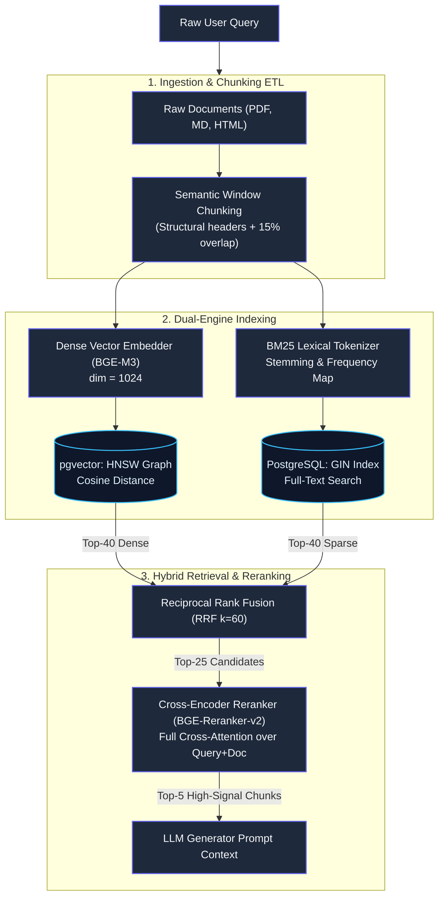

# CHAPTER 4: Production RAG and Hybrid Retrieval: Chunking, Vector Indexing (HNSW/IVF), BM25 and Cross-Encoders

## 4.1 Architectural Overview & Layer Scope

In Chapters 1–3, we analyzed how models learn and adapt parametric representations stored permanently in neural weights. However, parametric memory suffers from three fundamental enterprise limitations:
1. **Knowledge Cutoffs:** The model is blind to any event or internal document created after training.
2. **Hallucination Risk:** When uncertain, models predict probable-sounding tokens rather than grounded facts.
3. **Data Privacy & Access Control:** You cannot enforce row-level database permissions or tenant isolation inside a unified neural weight matrix.

**Retrieval-Augmented Generation (RAG)** separates storage from reasoning. The model acts as a reasoning engine, while an external retrieval system dynamically supplies verified reference context at query time.



---

## 4.2 Ingestion & Advanced Chunking Strategies

A vector search engine cannot retrieve what the ingestion pipeline failed to preserve. Chunking is the data preparation (ETL) phase where raw documents are segmented into indexed records.

### 4.2.1 The Failure of Fixed-Length Chunking
Traditional tutorials recommend fixed character/token slicing (e.g., 512 tokens with a 50-token overlap). In production documents (financial ledgers, legal contracts, API specs), this causes severe structural failures:
- **Boundary Truncation:** A table or conditional sentence is bisected: 
  - *Chunk A:* "...the penalty fee will be waived provided that..."
  - *Chunk B:* "...the transaction fails to settle within 48 hours."
  Neither chunk retains the complete conditional semantic meaning.
- **Context Stripping:** Slicing a paragraph from page 42 loses the parent document title, section header, and fiscal year.

### 4.2.2 Production Chunking Methodologies

| Chunking Strategy | Algorithmic Mechanism | Optimal Use Case | Weakness / Cost |
|---|---|---|---|
| **Contextual Chunking** | LLM generates a 50-word situational summary prepended to each chunk prior to embedding. | Complex domain documents, regulatory filings (SEC 10-K). | Requires $N$ LLM calls during ETL (higher ingestion cost). |
| **Parent-Document / Semantic Window** | Embed small child chunks (sentence-level) for vector search, but return the broader parent section to the LLM. | Technical manuals, granular Q&A where pinpoint retrieval is needed. | Storage overhead (storing both granular and parent nodes). |
| **Document Hierarchy (Markdown/HTML)** | Parse AST trees; split strictly along headers (`#`, `##`, `###`), table boundaries, and lists. | API documentation, Markdown knowledge bases, structured contracts. | Requires clean structural markup in source documents. |

```text
Semantic Window Retrieval Pattern:
┌────────────────────────────────────────────────────────────────────────┐
│ PARENT CONTEXT WINDOW (Returned to LLM: 1,500 tokens)                 │
│                                                                        │
│ ...Section 4.2: Merchant Settlement Rules...                           │
│ ┌──────────────────────────────────────────────┐                       │
│ │ CHILD CHUNK (Indexed in Vector DB: 80 tokens)│                       │
│ │ "Late payout penalty is 1.5% after Day 3."   │ ── Matched by Vector  │
│ └──────────────────────────────────────────────┘                       │
│ ...Surrounding mitigation criteria and ledger exceptions...            │
└────────────────────────────────────────────────────────────────────────┘
```

---

## 4.3 Vector Indexing Building Blocks: Approximate Nearest Neighbors (ANN)

Once chunks are converted into unit vectors $\vec{v} \in \mathbb{R}^{d}$, calculating exact nearest neighbors via brute-force flat search requires computing the cosine distance across every record in the database:
$$\text{Brute Force Time Complexity} = O(N \times d)$$
For an enterprise dataset with $N = 10,000,000$ documents and $d = 1,536$, a single query requires **15.36 billion floating-point operations**, resulting in multi-second query latencies.

To achieve sub-10ms response times, vector databases use **Approximate Nearest Neighbor (ANN)** indexing.

### 4.3.1 IVF-Flat (Inverted File Index)
IVF partitions vector space using **$k$-means clustering**:
1. **Clustering:** Partition the $d$-dimensional space into $C$ distinct Voronoi cells (centroids).
2. **Posting Lists:** Each vector is assigned to its nearest centroid.
3. **Query Execution:**
   - The query vector $\vec{q}$ is compared against the $C$ centroids.
   - The engine selects the closest `nprobe` centroids.
   - It scans only the vectors inside those specific Voronoi partitions.

```text
   IVF Voronoi Partition Space:
   ┌──────────────┬──────────────┐
   │   Cell 1     │   Cell 2     │
   │   •  •  •    │     •    •   │
   │     ▲        │       ▲      │
   │ Centroid 1   │   Centroid 2 │
   ├──────────────┼──────────────┤
   │   Cell 3     │   Cell 4     │
   │   •   •      │    •  •  •   │
   │     ▲        │       ▲      │
   │ Centroid 3   │   Centroid 4 │
   └──────────────┴──────────────┘
   Query q lands near Centroid 1 -> Scan ONLY Cell 1 (nprobe=1)
```

- **The Trade-Off Parameter (`nprobe`):**
  - Low `nprobe`: Ultra-fast query latency, but risks missing true nearest neighbors near partition boundaries (lower recall).
  - High `nprobe`: Higher recall, but approaches brute-force scan speed.

### 4.3.2 HNSW (Hierarchical Navigable Small World)
HNSW is the industry gold standard for vector search (used in Pinecone, Qdrant, Milvus, and pgvector). It builds a multi-layer graph based on the **Small World Phenomenon** (similar to a skip-list data structure, but in vector space).

```text
Layer 2 (Expressway):    (•) ───────────────────────────> (•)
                          │                                │
Layer 1 (Arterial):      (•) ─────────> (•) ─────────────> (•)
                          │              │                 │
Layer 0 (Local Roads):   (•) ──> (•) ──> (•) ──> (•) ──> (•) ──> (•)
(Dense graph containing all N vectors)
```

#### Search Mechanics:
1. Start at the top sparse layer (Layer 2) with a greedy routing algorithm: hop to whichever neighbor is closest to the query vector $\vec{q}$.
2. When a local minimum is reached in Layer 2, drop down to Layer 1 at that entry node.
3. Repeat the greedy search in Layer 1 until reaching another local minimum.
4. Drop to Layer 0 (which contains all data points) to perform fine-grained neighbor traversals.
- **Search Time Complexity:** $O(\log N)$ logarithmic scaling.
- **Cost:** High memory usage (stores multiple graph edges per node in RAM).

---

## 4.4 Sparse Retrieval & The BM25 Algorithm

Dense embeddings operate on semantic meaning, but fail on exact keyword lookups:
- Alphanumeric strings: `"Error_Code_0x80041010"`
- Exact product serials: `"SKU-992-TX"`
- Specific names: `"John C. Calhoun"` vs. `"John Calhoun"`

Production systems run an inverted index powered by **BM25 (Best Matching 25)** alongside vector search.

### 4.4.1 The BM25 Equation Deconstructed
For a query $Q$ with terms $q_1, q_2, \dots, q_n$ and document $D$:

$$\text{Score}_{\text{BM25}}(D, Q) = \sum_{i=1}^n \text{IDF}(q_i) \cdot \frac{f(q_i, D) \cdot (k_1 + 1)}{f(q_i, D) + k_1 \cdot \left(1 - b + b \cdot \frac{\vert{}D\vert{}}{\text{avgdl}}\right)}$$

Let us unpack the core components:

#### 1. Inverse Document Frequency ($\text{IDF}$):
$$\text{IDF}(q_i) = \ln\left(\frac{N - n(q_i) + 0.5}{n(q_i) + 0.5} + 1\right)$$
- $N$: Total documents in the collection.
- $n(q_i)$: Number of documents containing word $q_i$.
- Words appearing in every document (e.g., `"the"`, `"transaction"`) receive an IDF near zero. Rare terms (e.g., `"uncollectible"`) receive large positive scores.

#### 2. Term Frequency Saturation ($k_1$ parameter, typically $1.2 \le k_1 \le 2.0$):
In basic TF-IDF, if a word appears 20 times in a document, it gets $20\times$ the weight of a single appearance. 
BM25 uses an asymptotic saturation curve: as term frequency $f(q_i, D)$ increases, the marginal score bonus flattens out, preventing a spam document with 100 repeated keywords from dominating results.

#### 3. Document Length Normalization ($b$ parameter, typically $b \approx 0.75$):
- $\vert{}D\vert{} / \text{avgdl}$: The length of document $D$ divided by the average document length across the entire corpus.
- If a document is exceptionally long, a word match is more likely to occur by chance. The $b$ parameter penalizes excessively long chunks so short, focused passages rank higher.

---

## 4.5 Hybrid Retrieval & Reciprocal Rank Fusion (RRF)

Dense search and sparse search output fundamentally incompatible scoring distributions:
- Cosine Distance ranges strictly from $[-1.0, 1.0]$.
- BM25 scores are unbounded positive numbers ($[0, \infty)$) depending on corpus statistics.

Normalizing raw scores via min-max scaling is brittle: a single extreme keyword outlier compresses the rest of the distribution. Production architectures merge outputs using **Reciprocal Rank Fusion (RRF)**.

### 4.5.1 The RRF Mathematical Formulation
RRF discards raw scores entirely and operates purely on **Rank Positions**:

$$RRF\_Score(d) = \sum_{m \in M} \frac{1}{k + r_m(d)}$$

Where:
- $M$: The set of retrieval systems (e.g., $M = \{\text{Dense Vector}, \text{Sparse BM25}\}$).
- $r_m(d)$: The 1-based rank position of document $d$ in system $m$.
- $k$: Smoothing constant (industry standard is $k = 60$). It prevents items that ranked #1 in only one list from completely dominating items that ranked #2 across both lists.

---

## 4.6 Cross-Encoder Rerankers: The Precision Filter

Why not feed all top-100 hybrid retrieval chunks directly into an LLM context window?
1. **The "Lost in the Middle" Effect (Liu et al.):** LLMs exhibit high recall for information placed at the very beginning or end of their context window, but frequently miss details buried in the middle 60%.
2. **Token Economics & Latency:** Stuffing 100 chunks ($\approx 40,000$ tokens) into every prompt increases inference costs and adds significant time-to-first-token (TTFT) latency.

We resolve this by applying a **Cross-Encoder Reranker** (e.g., Cohere Rerank, BGE-Reranker-Large) to compress the top-50 candidates down to the top-5 most relevant chunks.

```text
BI-ENCODER (Embedding Search):
Query:      "Ledger chargeback"  ──> [ Embedding Model ] ──> Vector Q
                                                               │ (Cosine Match)
Document:   "Fraud dispute rule" ──> [ Embedding Model ] ──> Vector D
(Zero cross-interaction between Query tokens and Document tokens!)

VS.

CROSS-ENCODER (Reranking):
Input: [CLS] "Ledger chargeback" [SEP] "Fraud dispute rule" [EOS]
                               │
                               ▼
               [ Full Transformer Cross-Attention ]
(Every single query word computes attention against every single document word)
                               │
                               ▼
                     Relevance Score: 0.942
```

### Bi-Encoders vs. Cross-Encoders Comparison

| Characteristic | Bi-Encoder (Dense Vector Search) | Cross-Encoder (Reranker) |
|---|---|---|
| **Architecture** | Independent encoding of Query and Document into single vectors. | Joint sequence encoding; full cross-attention across all tokens. |
| **Computational Cost** | Very low ($O(1)$ lookup via indexed ANN graphs). | Very high (requires a complete forward pass per document). |
| **Scalability** | Can search 100,000,000 candidates in milliseconds. | Realistic ceiling of 30 to 100 candidates per query. |
| **Relevance Accuracy** | Moderate (semantic proximity, misses subtle syntax). | **State-of-the-Art** (captures negation, exact relationships). |

---

## 4.7 Concrete Numerical Walkthrough: The Hybrid Fusion Step

Let us trace an explicit mathematical calculation of a Hybrid Search run across a candidate pool of 4 documents:

### Inputs:
- Query: `"Merchant liability in card unauthorized transaction"`
- Smoothing constant: $k = 60$

### Retrieval Stage Results:
- **BM25 Search Top Ranks:**
  - Rank 1: Document C (`"Unauthorized card transaction merchant code"`)
  - Rank 2: Document A (`"Merchant liability rules and dispute chargeback"`)
  - Rank 3: Document D (`"Cardholder unauthorized ATM withdrawals"`)
  - Rank 4: Document B (`"Standard payout schedules"`)
- **Dense Vector Search Top Ranks:**
  - Rank 1: Document A
  - Rank 2: Document B
  - Rank 3: Document C
  - Rank 4: Document D

### RRF Score Calculation:

#### Document A:
- Dense Rank: 1 | Sparse Rank: 2
$$RRF(A) = \frac{1}{60 + 1} + \frac{1}{60 + 2} = \frac{1}{61} + \frac{1}{62} = 0.01639 + 0.01613 = \mathbf{0.03252}$$

#### Document B:
- Dense Rank: 2 | Sparse Rank: 4
$$RRF(B) = \frac{1}{60 + 2} + \frac{1}{60 + 4} = \frac{1}{62} + \frac{1}{64} = 0.01613 + 0.01563 = \mathbf{0.03176}$$

#### Document C:
- Dense Rank: 3 | Sparse Rank: 1
$$RRF(C) = \frac{1}{60 + 3} + \frac{1}{60 + 1} = \frac{1}{63} + \frac{1}{61} = 0.01587 + 0.01639 = \mathbf{0.03226}$$

#### Document D:
- Dense Rank: 4 | Sparse Rank: 3
$$RRF(D) = \frac{1}{60 + 4} + \frac{1}{60 + 3} = \frac{1}{64} + \frac{1}{63} = 0.01563 + 0.01587 = \mathbf{0.03150}$$

### Final Ranked Order:
1. **Document A:** Score $0.03252$ (Consistent top performer across both modes)
2. **Document C:** Score $0.03226$
3. **Document B:** Score $0.03176$
4. **Document D:** Score $0.03150$

Document A secures the top ranking because it demonstrated balanced performance across both semantic and keyword paradigms, rather than relying on an outlier score in a single channel.

---

## 4.8 Production Failure Modes & Engineering Audits

### 1. The Metadata Stripping Bug
- **Symptom:** The retrieval engine returns the correct financial table chunk, but the downstream LLM produces incorrect calculations or hallucinated dates.
- **Root Cause:** Raw markdown tables were converted to vectors without parent headers. The table contained columns `[Month, Net_Revenue]`, but lacked the year `2025` present in the top-level section title.
- **Engineering Fix:** Implement **Header Prepending ETL**. Traverse the document structure and prepend the full breadcrumb path to every chunk before generating its embedding:
  `"Path: Financials > North America > FY2025 > Q3 Report | Table Data: ..."`

### 2. Inverted Index Stemming Collisions
- **Symptom:** A search for `"banking platform"` returns internal documents discussing `"river banks"` or `"blood banking"`.
- **Root Cause:** Over-aggressive Porter Stemming in BM25 reduced `"banking"` to `"bank"`, conflating distinct financial and geographic entities.
- **Audit Rule:** Use linguistic tokenizers with specialized domain stop-word lists and POS (Part-of-Speech) tagging rather than naive algorithmic stemmers when handling specialized enterprise corpora.

### 3. Vector Database HNSW Index Drift
- **Symptom:** Retrieval latency increases by $300\%$ and recall drops over a 6-month period without code changes.
- **Root Cause:** The database performed thousands of incremental row deletions and updates. In HNSW, deleting vectors leaves tombstone markers that break graph traversability, turning $O(\log N)$ searches into degraded, fractured graph paths.
- **Engineering Fix:** Schedule automated weekly index vacuuming and graph rebuilds (`REINDEX`) during maintenance windows.

---

## 4.9 Chapter Summary Checkpoint

1. **RAG** resolves knowledge cutoffs and hallucination risks by decoupling parametric model reasoning from dynamic, verified external context.
2. **Contextual & Semantic Window Chunking** prevents structural bisection, ensuring critical boundary relationships and metadata survive the ETL ingestion process.
3. **HNSW** provides $O(\log N)$ vector search by organizing embeddings into a hierarchical graph, while **IVF-Flat** relies on Voronoi cell clustering.
4. **Hybrid Retrieval with RRF** is non-negotiable for enterprise search: it combines the broad semantic understanding of vector embeddings with the exact alphanumeric precision of BM25.
5. **Cross-Encoders** act as a precision filter: they compute full token-to-token cross-attention between query and passage, eliminating false positives before context reaches the final model.
