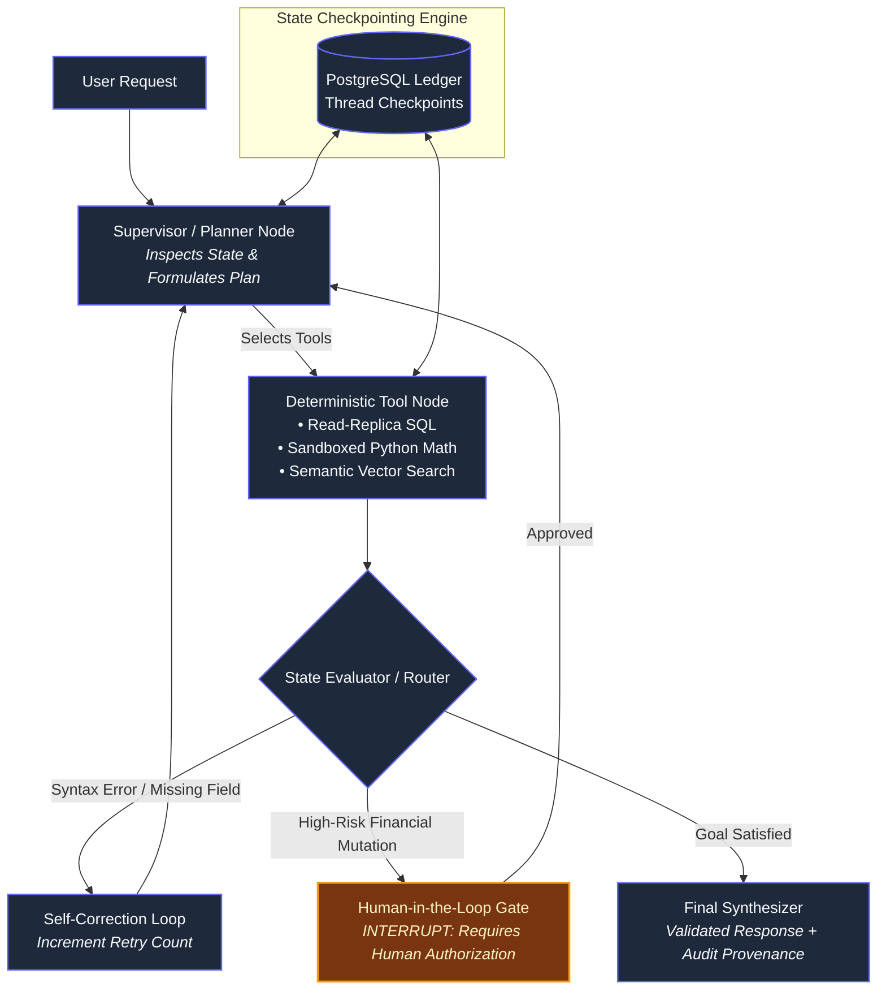

# CHAPTER 5: Stateful Agentic Systems: State Graphs, Deterministic Tools, Pydantic Schemas and Human-in-the-Loop

## 5.1 Architectural Overview & Layer Scope

In Chapters 1 through 4, we examined static generation and passive retrieval (RAG). However, passive pipelines cannot solve problems that require dynamic branching, iterative multi-step reasoning, external environment interaction, or automated error recovery.

An **Agent** is an autonomous system that uses a foundation model as a reasoning and routing engine to observe an environment, update an internal state, select and execute tools, and iterate until a predefined objective is achieved.



---

## 5.2 From Linear Chains to Cyclic State Graphs

Early generative AI orchestration (e.g., standard LangChain sequential chains) used **Directed Acyclic Graphs (DAGs)**. DAGs enforce rigid, linear flows:

$$\text{Input} \longrightarrow \text{Step } 1 \longrightarrow \text{Step } 2 \longrightarrow \text{Step } 3 \longrightarrow \text{Output}$$

### 5.2.1 Why Linear DAGs Fail in Production
1. **Zero Error Recovery:** If Step 2 (e.g., generating an automated SQL query) encounters a syntax error or a database lock, the entire chain fails.
2. **No Reflection or Self-Correction:** A model cannot review its own output, identify a calculation variance, and re-run the calculation with corrected parameters.
3. **Unbounded Context Accumulation:** Passing full conversational history through each sequential step exhausts context limits and increases inference costs.

### 5.2.2 The State Graph Architecture (LangGraph Pattern)
Modern production agents are built as **Cyclic State Machines**. A state machine consists of three main parts:

```text
┌────────────────────────────────────────────────────────────────────────┐
│                        STATE GRAPH BUILDING BLOCKS                          │
├────────────────────────────────────────────────────────────────────────┤
│ 1. State: The unified schema representing current system reality       │
│ 2. Nodes: Deterministic Python functions that transform state          │
│ 3. Edges: Control flow transitions (Deterministic or Conditional)      │
└────────────────────────────────────────────────────────────────────────┘
```

#### 1. The State Schema & Reducer Logic:
The state acts as an in-memory database record passed to every node. It uses **Reducers** to dictate how new data merges into existing keys:

```text
State Schema Definition:
{
    "messages":        List[ChatMessage],   --> Reducer: Append (operator.add)
    "extracted_data":  Dict[str, Any],      --> Reducer: Deep Merge
    "retry_count":     int,                 --> Reducer: Overwrite (replace)
    "current_status":  str                  --> Reducer: Overwrite (replace)
}
```

#### 2. Nodes: Pure State Transformers

A node is an isolated function $f: \text{State} \to \Delta\text{State}$. It receives the current state, runs computation (such as calling an LLM or querying a database), and returns only the **delta (the specific keys to update)**:

```python
def query_database_node(state: AgentState) -> dict:
    # 1. Read parameters from state
    sql = state["generated_sql"]
    
    # 2. Execute deterministic side-effect
    result = db_engine.execute(sql)
    
    # 3. Return only the state update delta
    return {"query_results": result, "retry_count": state["retry_count"] + 1}
```

#### 3. Conditional Edges: The Dynamic Routers

Unlike static DAGs, edges evaluate current state variables to determine the subsequent path:

$$\text{Next Node} = \text{RouterFunction}(\text{State})$$

If an execution node throws an exception, the conditional router loops execution back to the planning node along with the explicit database error string, triggering an automated repair cycle.

---

## 5.3 Deterministic Tool Execution & Pydantic Validation

LLMs do not execute code directly; they predict text tokens representing function invocations. Treating raw model outputs as executable instructions without validation exposes production backends to arbitrary code execution, SQL injections, and system crashes.

### 5.3.1 The Structured Output Contract: JSON Schema & Pydantic

Every tool exposed to an agent must define a strict boundary contract using **Pydantic** or **JSON Schema**.

```text
                [ LLM Logit Output ]
                         │
                         ▼
        { "action": "run_sql", "args": { ... } }
                         │
                         ▼
         ┌───────────────────────────────┐
         │   Pydantic Validation Gate    │
         ├───────────────────────────────┤
         │ • Type Enforcement            │
         │ • Range & Constraint Checks   │
         │ • Regex & Enum Verification   │
         └───────────────┬───────────────┘
                         │
         ┌───────────────┴───────────────┐
         │ (Schema Valid)                │ (ValidationError)
         ▼                               ▼
 [ Sandboxed Tool Runtime ]     [ Catch Error & Re-route ]
 - Read-Only DB Replica          - Return error trace to LLM:
 - Prepared Statements             "Field 'limit' must be <= 100"
 - Statement Timeout: 5000ms     - Prompt model to self-correct
```

### 5.3.2 Defining Resilient Tool Interfaces

```python
from pydantic import BaseModel, Field
from typing import Literal

class LedgerQueryToolInput(BaseModel):
    account_id: str = Field(
        ..., 
        regex=r"^ACC-[0-9]{6}$", 
        description="Target account identifier in format ACC-XXXXXX"
    )
    time_window: Literal["7D", "30D", "90D", "YTD"] = Field(
        ..., 
        description="Aggregation time horizon"
    )
    max_records: int = Field(
        default=50, 
        ge=1, 
        le=100, 
        description="Row limit to prevent context window saturation"
    )
```

### 5.3.3 The Three Hard Rules of Production Tool Design

1. **Never Execute on Read-Write Primary Databases:** Agents must run exclusively against read-only replicas with restricted service accounts (`GRANT SELECT ON ...`).
2. **Enforce Hard Timeouts and Row Ceilings:** Every tool execution must implement explicit statement timeouts (e.g., `SET statement_timeout = '3000ms'`) and hard output truncation to avoid context flooding.
3. **No Dynamic String Interpolation:** SQL statements generated by agents must utilize parameterized binds rather than raw string formatting to prevent prompt injection payload execution.

---

## 5.4 Agent Memory Architectures: Short-Term vs. Long-Term

Agents require memory to maintain behavioral consistency over time. Enterprise systems separate memory into two distinct functional layers:

```text
┌────────────────────────────────────────────────────────────────────────┐
│                        AGENT MEMORY HIERARCHY                          │
├────────────────────────────────────────────────────────────────────────┤
│ 1. Short-Term (Thread) Memory:                                         │
│    - Volatile, scoped to the active session or task                    │
│    - Managed via Graph Checkpointing & Sliding Token Windows           │
│                                                                        │
│ 2. Long-Term (Semantic / Episodic) Memory:                             │
│    - Persistent across sessions and system restarts                    │
│    - Backed by Vector DBs, Knowledge Graphs & Entity Tables            │
└────────────────────────────────────────────────────────────────────────┘
```

### 5.4.1 Short-Term Memory: Checkpointers and State Trimming

Short-term memory tracks conversation flow and intermediate execution steps.

* **The Context Satiation Bottleneck:** Every intermediate tool execution, raw JSON payload, and reflection note consumes context tokens. If left unchecked, the context window fills up, driving up cost and causing attention degradation.
* **Trimming Strategies:**
  - **Message Windowing:** Retain only the last $K$ messages, evicting older steps.
  - **State Condensation Nodes:** When total token count exceeds a threshold (e.g., 8,000 tokens), an intermediate node generates a concise analytical summary of past turns, replacing the raw history array with a single summary message.

### 5.4.2 Long-Term Memory: Episodic & Entity Stores

Long-term memory stores facts, user behavioral preferences, and past analytical solutions across sessions.

```sql
-- Relational Schema for Long-Term Agent Memory:
CREATE TABLE agent_episodic_memory (
    memory_id UUID PRIMARY KEY DEFAULT gen_random_uuid(),
    tenant_id VARCHAR(64) NOT NULL,
    entity_key VARCHAR(128) NOT NULL,  -- e.g., 'user_risk_tolerance'
    fact_payload JSONB NOT NULL,       -- e.g., '{"level": "conservative", "strict_audit": true}'
    source_session_id VARCHAR(64),
    embedding_vector VECTOR(1536),     -- For semantic lookup
    created_at TIMESTAMP WITH TIME ZONE DEFAULT NOW(),
    last_accessed_at TIMESTAMP WITH TIME ZONE DEFAULT NOW()
);

CREATE INDEX idx_agent_memory_vector 
ON agent_episodic_memory 
USING ivfflat (embedding_vector vector_cosine_ops);
```

When an agent initializes a session, it queries both structured entity keys and vector embeddings to load relevant historical facts before planning its initial steps.

---

## 5.5 Checkpointing, Time-Travel & Human-in-the-Loop (HITL)

In mission-critical enterprise systems, completely autonomous agents present operational risk. High-stakes actions (such as authorizing wire transfers, modifying production balances, or releasing public reports) require strict oversight mechanisms.

### 5.5.1 Checkpointer Persistence Engines

A **Checkpointer** serializes and writes the entire state graph to persistent storage (PostgreSQL, Redis, or SQLite) after every node execution.

```text
Node 1 (Parse Query) ───► [Save State @ Checkpoint 101] (Postgres)
          │
          ▼
Node 2 (Execute SQL) ───► [Save State @ Checkpoint 102] (Postgres)
          │
          ▼
Node 3 (Risk Audit)  ───► [Save State @ Checkpoint 103] (Postgres)
```

#### Why Continuous State Persistence Matters:

1. **Fault Tolerance:** If a worker node crashes mid-execution, the agent resumes from its last saved checkpoint without re-running prior tools.
2. **Audit Trails & Compliance:** Every single intermediate step, tool argument, and model thought is permanently recorded for regulatory inspection.

### 5.5.2 Time-Travel Debugging

Because states are version-controlled by checkpoint IDs, engineers can navigate backward through the execution history:

* Replay an agent's run from Step 3 to analyze why it diverged.
* Manually edit a single variable in the saved state at Checkpoint 102 (e.g., correcting a date string).
* Resume graph execution from that edited fork to verify downstream behavioral changes.

### 5.5.3 Human-in-the-Loop (HITL) Approval Interrupts

An **Interrupt** suspends graph execution immediately prior to running a sensitive node:

```text
[ Planner Node ] ──► [ Generate Mutation Payload ] ──► [ INTERRUPT ]
                                                              │
                                            (Engine saves state & pauses)
                                                              │
                                            (Emits pending approval webhook)
                                                              │
                     ┌────────────────────────────────────────┴────────────────────────────────────────┐
                     ▼                                                                                 ▼
         [ Human Approves (API) ]                                                          [ Human Modifies or Rejects ]
                     │                                                                                 │
       (Graph Unpauses & Executes)                                                       (State updated with feedback)
                     │                                                                                 │
                     ▼                                                                                 ▼
           [ Database Mutation ]                                                              [ Re-route to Planner ]
```

The system issues a webhook notification containing the proposed payload. The thread stays frozen until an operator reviews the proposed action and submits an external `approve` or `reject` signal via API.

---

## 5.6 Concrete Walkthrough: Autonomous SQL Auditor Agent

Let us trace a complete lifecycle for an autonomous ledger auditing agent checking a financial mismatch.

### System Goal:

*"Check if merchant `M-881` had any unauthorized transaction adjustments greater than $5,000 in Q3 2026."*

```text
Execution Trace:
Step 1: State Initialization
{
  "messages": ["User query received"],
  "merchant_id": "M-881",
  "sql_query": null,
  "query_results": null,
  "retry_count": 0,
  "status": "PLANNING"
}

Step 2: Planner Node (LLM Forward Pass)
Action: Generate SQL query based on database schema.
State Delta: 
{
  "sql_query": "SELECT * FROM adjustments WHERE m_id = 'M-881' AND val > 5000",
  "status": "EXECUTING"
}

Step 3: Tool Execution Node (Deterministic Engine)
Engine executes query against database replica.
Database returns an error:
"Column 'val' does not exist. Did you mean 'adjustment_amount'?"
State Delta:
{
  "query_results": "ERROR: Column 'val' does not exist in table 'adjustments'.",
  "retry_count": 1,
  "status": "RETRY_REQUIRED"
}

Step 4: Conditional Edge Routing
Condition check: `if status == "RETRY_REQUIRED" and retry_count < 3`
Route: Redirect back to Planner Node with error message appended.

Step 5: Planner Node (Automated Self-Correction)
LLM reads the database error, updates its internal plan, and corrects the syntax.
State Delta:
{
  "sql_query": "SELECT adjustment_id, adjustment_amount FROM adjustments WHERE m_id = 'M-881' AND adjustment_amount > 5000 AND created_at >= '2026-07-01' AND created_at <= '2026-09-30';",
  "status": "EXECUTING"
}

Step 6: Tool Execution Node (Second Pass)
Database executes query successfully:
Returns: `[{"adjustment_id": "ADJ-991", "adjustment_amount": 7500.00}]`
State Delta:
{
  "query_results": [{"adjustment_id": "ADJ-991", "adjustment_amount": 7500.00}],
  "status": "ANALYSIS_COMPLETE"
}

Step 7: Final Node (Response Generation)
LLM formats grounded response citing Adjustment ID `ADJ-991` with zero hallucinations.
```

---

## 5.7 Production Failure Modes & Engineering Audits

### 1. The Infinite Recursive Loop (Token Burn)

* **Symptom:** An agent gets stuck oscillating between two nodes, making 50 API calls in 2 minutes and consuming millions of tokens before crashing.
* **Root Cause:** A tool continually returns an unexpected error format that the planning node cannot interpret, causing an infinite retry loop without state changes.
* **Engineering Fix:**
  - Enforce a strict **Recursion Ceiling** on the state engine (e.g., `max_iterations = 8`).
  - Implement a **Loop Circuit Breaker**: If `state["retry_count"] >= 3`, bypass the planner and route directly to a fallback escalation node that alerts on-call engineering.

### 2. Context Window Pollution from Massive Tool Returns

* **Symptom:** An agent runs smoothly on small tests, but throws context-length errors or hallucinates wildly when deployed on real customer records.
* **Root Cause:** The database tool executed a query that returned 5,000 rows. The agent stuffed this multi-megabyte JSON array directly into its short-term message state, evicting the original system instructions from attention memory.
* **Engineering Fix:**
  - Restrict tool returns to summary aggregates or truncate outputs with explicit row ceilings (`LIMIT 25`).
  - Store large raw outputs out-of-band in cloud storage (e.g., S3/Blob storage) and pass only the storage reference key and an aggregated summary back into the LLM context.

### 3. Tool Selection Ambiguity & Hallucinated Invocation

* **Symptom:** When provided with a library of 30 different tools, the model often invokes the wrong function or hallucinates non-existent function arguments.
* **Root Cause:** Exposing too many tools in a single flat prompt degrades function-calling accuracy. Attention weights spread thin across competing tool descriptions.
* **Engineering Fix:** Implement a **Multi-Agent Hierarchical Pattern (Supervisor Pattern)**:
  - The top-level Supervisor agent has zero direct execution tools; it only has access to route tasks to specialized sub-agents (e.g., *Database Specialist*, *API Integrator*, *Compliance Auditor*).
  - Each sub-agent maintains a focused scope of 2–4 tools, maximizing function-calling accuracy.

---

## 5.8 Chapter Summary Checkpoint

1. **State Graphs** replace brittle, linear chains with cyclic state machines that support dynamic branching, error recovery loops, and iterative self-correction.
2. **Pydantic Schemas** provide the runtime validation layer between stochastic model outputs and deterministic enterprise infrastructure, catching type mismatches and invalid arguments before execution.
3. **Agent Memory** must be partitioned: short-term memory handles the active task using graph checkpoints and token-trimming policies, while long-term memory preserves durable entity knowledge across sessions.
4. **Checkpointers** write every state change to persistent storage, enabling system fault tolerance, compliance audit logging, and time-travel debugging.
5. **Human-in-the-Loop (HITL)** gates pause the graph via interrupts before irreversible mutations occur, allowing human operators to inspect and authorize actions.
