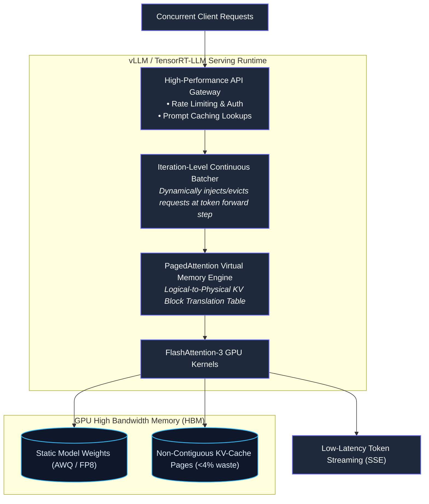

# CHAPTER 6: Serving Engines and High-Throughput Infrastructure: vLLM, PagedAttention, Continuous Batching and Quantization

## 6.1 Architectural Overview & Layer Scope

In Chapters 1 through 5, we explored how models are constructed, adapted, augmented with external context (RAG), and orchestrated as autonomous state graphs. However, running an inference system in a development notebook or via single-request REST calls fails under production workloads.

Production AI infrastructure is governed by hardware utilization economics: maximizing throughput (tokens generated per second per dollar of compute) while strictly adhering to Service Level Agreements (SLAs) for latency.



---

## 6.2 The Compute vs. Memory Dilemma: The Roofline Model

To optimize model serving, you must understand the hardware constraints governing the two distinct operational phases of inference.

```text
   Arithmetic Intensity (FLOPs / Byte Transferred)
   0                       100                      200
Peak ┌────────────────────────────────────────────────── Compute-Bound Roofline
FLOPs│                                     /══════════════════════════════════
     │                                    /  (Prefill Phase: Saturated Matrix Math)
     │                                   /
     │                                  /
     │                                 /
     │                                /
     │                               /
     │                              /   (Decode Phase: Starved for Bytes)
     │                             /
0    └────────────────────────────/──────────────────────────────────────────
     0                    Memory Bandwidth Limit (GB/sec)
```

### 6.2.1 The Two Phases Deconstructed
1. **Prefill Phase (Prompt Ingestion):**
   - The user provides a 2,000-token prompt.
   - The model processes all 2,000 tokens concurrently in a single forward pass.
   - Attention calculation involves dense matrix multiplications ($Q \times K^T$ and $P \times V$).
   - **Hardware Regime:** **Compute-Bound**. Tensor Cores are fully saturated. Memory bandwidth is rarely the bottleneck here; raw floating-point operations per second (FLOPs) determine the speed.
   - **User Metric:** Determines **Time-To-First-Token (TTFT)**.

2. **Decode Phase (Autoregressive Generation):**
   - The model produces one token at a time: $t_1, t_2, t_3, \dots, t_N$.
   - Each new token requires reading the entire model weight matrix ($W$) and the accumulated Key-Value history ($KV$) from High Bandwidth Memory (HBM) into fast on-chip SRAM/registers to perform a single vector-matrix multiplication.
   - **Hardware Regime:** **Memory Bandwidth-Bound**. The Tensor Cores complete the arithmetic almost instantly and spend the remainder of the clock cycles idling while waiting for weights and cache data to stream across the memory bus.
   - **User Metric:** Determines **Inter-Token Latency (ITL)** / Tokens Per Second (TPS).

### 6.2.2 The Arithmetic Intensity Metric
$$\text{Arithmetic Intensity} = \frac{\text{FLOPs Executed}}{\text{Bytes Transferred from Memory}}$$

On an NVIDIA H100 GPU:
- **Peak Compute (BF16):** $\approx 989 \text{ TFLOPs}$
- **Peak Memory Bandwidth:** $\approx 3,350 \text{ GB/sec}$
- **Hardware Balance Point:** $\frac{989 \times 10^{12}}{3,350 \times 10^9} \approx 295 \text{ FLOPs/Byte}$

If an operation executes fewer than 295 mathematical calculations for every single byte loaded from VRAM, **the GPU is memory-bandwidth starved**. In single-batch decoding, arithmetic intensity drops below $5 \text{ FLOPs/Byte}$, utilizing less than 2% of the theoretical compute power of an enterprise GPU.

---

## 6.3 PagedAttention: Resolving the KV-Cache Memory Crisis

Before the development of **PagedAttention** (Kwon et al., UC Berkeley / vLLM project, 2023), serving systems suffered catastrophic memory waste due to static memory allocation.

### 6.3.1 The Failures of Traditional Serving (HuggingFace / Standard PyTorch)
Traditional runtimes pre-allocate contiguous memory buffers in VRAM for each sequence's maximum theoretical context window (e.g., reserving 8,192 tokens of space for every incoming connection):

```text
Traditional Contiguous Pre-allocation (Context Limit: 8K tokens):
User Request 1 (Prompt: 500 tokens, Output: 200 tokens):
[ Actual KV Used: 700 tokens ] [ Wasted Fragmented Reservation: 7,492 tokens (91% wasted!) ]
```

This architecture produces three forms of memory loss:
1. **Internal Fragmentation:** Reserving space for the maximum possible generation length that is never utilized by shorter responses.
2. **External Fragmentation:** Memory allocators cannot find large, contiguous blocks for new requests even though total free VRAM is abundant.
3. **Reservation Overhead:** Inability to dynamically share memory between parent prompts and child branches (e.g., in parallel sampling or multi-turn chats).

Traditional systems wasted **60% to 80% of total GPU memory**, strictly capping concurrency to 4–8 requests per GPU.

### 6.3.2 Virtual Memory Mechanics Applied to VRAM
PagedAttention solves this by mirroring the **Virtual Memory Paging** mechanism of operating systems:

```text
LOGICAL KV CACHE (Sequential View per Request):
Logical Blocks:   [ Block 0 ] ───► [ Block 1 ] ───► [ Block 2 ]
                 (Tokens 0-15)    (Tokens 16-31)   (Tokens 32-47)
                        │                │                │
                        ▼                ▼                ▼
BLOCK TABLE:        Frame 7          Frame 2          Frame 91
(Page Map)              │                │                │
                        ▼                ▼                ▼
PHYSICAL VRAM:     [ Phys Block 2 ]  [ Phys Block 7 ]  [ Phys Block 91 ]
(Non-contiguous)     (Tokens 16-31)    (Tokens 0-15)    (Tokens 32-47)
```

#### How PagedAttention Operates:
1. The KV cache is divided into fixed-size **Physical Blocks** (typically holding $16$ or $32$ tokens).
2. Blocks are allocated on-demand from a global pool of free memory pages as tokens are generated.
3. Logical sequential token indices are mapped to physical non-contiguous GPU memory addresses via a **Block Table**.
4. **Zero Internal Fragmentation:** Memory is allocated only when a block fills up. Waste is restricted strictly to the final incomplete block ($< 16$ tokens).

### 6.3.3 Copy-on-Write (CoW) Memory Sharing
When executing workflows that share identical prompt prefixes (such as system prompts, few-shot examples, or parallel generation branches), PagedAttention maps multiple logical prompts to the **exact same physical KV blocks**:

```text
Prompt A: System Instructions (500 tokens) + Query A
Prompt B: System Instructions (500 tokens) + Query B

Both Request A and Request B reference Physical Blocks 0–31 simultaneously!
Only when Request A generates its unique token does the engine allocate a new physical block.
```
This reduces prompt ingestion memory overhead by up to 90% in agentic and multi-turn workflows.

---

## 6.4 Batching Strategies: Static, Dynamic & Continuous

How requests are grouped into execution batches dictates serving economics.

```text
1. STATIC BATCHING (Lockstep Processing):
Req 1 (Short):   [Prefill] [D] [D] [EOS] ── Idle ── Idle ── Idle ── Idle ──┐
Req 2 (Medium):  [Prefill] [D] [D] [D]   [D] [D] [EOS] ── Idle ── Idle ──┤ Entire Batch Waits!
Req 3 (Long):    [Prefill] [D] [D] [D]   [D] [D] [D]   [D] [D] [EOS] ─────┘

2. CONTINUOUS BATCHING (Iteration-Level Scheduling):
Step t:   [Req 1: Decode] [Req 2: Decode] [Req 3: Decode]
Step t+1: [Req 1: EOS   ] [Req 2: Decode] [Req 3: Decode] ──► Req 1 Completes & Evicts!
Step t+2: [Req 4: Prefill] [Req 2: Decode] [Req 3: Decode] ──► Req 4 Inserts Immediately!
Step t+3: [Req 4: Decode ] [Req 2: Decode] [Req 3: Decode]
```

### 6.4.1 The Three Generations of Batching

| Paradigm | Scheduling Mechanism | Latency Impact | Hardware Efficiency |
|---|---|---|---|
| **Static Batching** | Wait for $N$ requests to arrive; execute all concurrently; return results only when the *longest* sequence finishes. | Terrible (dictated by the slowest/longest request). | Low (massive GPU idle time across shorter sequences). |
| **Dynamic Batching** | Collect incoming requests within a static timeout window (e.g., 50ms) and batch them together. | Moderate (better responsiveness, but still waits on sequence completion). | Medium. |
| **Continuous Batching (Orca / vLLM)** | **Iteration-level scheduling**. After every individual decode step, finished requests are evicted and new requests are inserted into the next forward pass. | **Optimal**. Minimal queuing delay; immediate resource reclamation. | **Maximum**. Keeps Tensor Cores continuously saturated. |

### 6.4.2 Chunked Prefills (Mitigating Head-of-Line Blocking)
A major challenge in continuous batching is that a new request requiring a 4,000-token prefill will dominate GPU compute during its forward pass, causing active decoding requests to stall and generating a large spike in **Inter-Token Latency (ITL)**.

**The Solution: Chunked Prefills.** The engine slices massive prefill sequences into smaller chunks (e.g., 512 tokens). It executes one prefill chunk interleaved with the decoding passes of active streams, keeping token generation smooth and predictable.

---

## 6.5 Quantization Formats & Hardware Precision

Quantization reduces memory requirements and increases memory bandwidth throughput by compressing floating-point values into lower bit-width representations.

```text
Bit Representation Layout:
FP32 (Single):  [ 1 Sign ] [ 8 Exponent ] [ 23 Mantissa / Fraction ]  (4 Bytes)
BF16 (Brain):   [ 1 Sign ] [ 8 Exponent ] [ 7 Mantissa / Fraction  ]  (2 Bytes)
FP16 (Half):    [ 1 Sign ] [ 5 Exponent ] [ 10 Mantissa / Fraction ]  (2 Bytes)
FP8 (E4M3):     [ 1 Sign ] [ 4 Exponent ] [ 3 Mantissa / Fraction  ]  (1 Byte)
INT4 (Integer): [ 4 Bits: Represents integer index mapped to a scale factor ] (0.5 Bytes)
```

### 6.5.1 The Primary Quantization Standards

#### 1. AWQ (Activation-aware Weight Quantization):
- **Insight:** Not all weights in a network are equally important. Looking at the magnitude of activations flowing through the model reveals that **only 0.1% to 1% of channels dictate output quality**.
- **Mechanism:** AWQ identifies these salient channels and protects them from aggressive quantization by calculating channel-specific scaling factors. The remaining weights are compressed to 4-bit integers.
- **Hardware Target:** Cloud GPU deployment (vLLM, TensorRT-LLM) using specialized 4-bit matrix multiplication kernels (`W4A16`, meaning 4-bit weights and 16-bit activations).

#### 2. GPTQ (Generalized Post-Training Quantization):
- **Mechanism:** GPTQ uses second-order Taylor expansions (the Hessian matrix of the loss surface) to quantize weights layer-by-layer, adjusting unquantized weights in the same layer to compensate for the mathematical error introduced by the quantized ones.
- **Characteristics:** Highly accurate at 4-bit, but slower to calibrate than AWQ.

#### 3. GGUF (GGML Universal Format):
- **Mechanism:** Designed by Georgi Gerganov (`llama.cpp`), GGUF bundles metadata, tokenizer configurations, and quantized weight tensors into a single, self-contained file.
- **Characteristics:** Optimized for **CPU, Apple Silicon (Metal Unified Memory), and Edge Devices**. Supports variable-precision quant schemes (e.g., `Q4_K_M`, where attention weights are kept at higher precision while MLP weights are compressed).

#### 4. Native FP8 (E4M3 vs. E5M2):
- Native hardware support on **NVIDIA Ada Lovelace (L40S) and Hopper (H100/H200)** architectures.
- **E4M3 (4 exponent, 3 mantissa bits):** Best for forward pass inference (preserves numerical precision).
- **E5M2 (5 exponent, 2 mantissa bits):** Matches FP16 dynamic range; useful for gradients and backward updates.
- Cuts model memory by 50% compared to BF16 with virtually **zero degradation in output fidelity**.

---

## 6.6 The Production Latency SLA Equations

When designing an enterprise service level agreement, latency cannot be stated as a single flat number. It is decomposed into three distinct mathematical metrics:

```text
[ Request Sent ]
       │
       ▼ (Queuing & Network Routing)
 [ Gateway ]
       │
       ▼ (Prefill Phase: Compute Bound)
[ First Token Emitted ]  <─── Time-To-First-Token (TTFT)
       │
       ├─► Token 2  <─── Inter-Token Latency (ITL)
       ├─► Token 3  <─── Inter-Token Latency (ITL)
       ├─► Token 4  <─── Inter-Token Latency (ITL)
       ▼
 [ Final Token [EOS] ]
       └───────────────────────────────────────────────────► Total End-to-End Latency
```

### 1. Time-To-First-Token (TTFT):
$$\text{TTFT} = T_{\text{queue}} + \frac{S_{\text{prompt}} \times 2 P}{\text{Peak Achievable GPU FLOPs}}$$
*(Where $P$ is parameter count, and $S_{\text{prompt}}$ is input length).*
- Governed by prompt length, queuing delay, and compute throughput. Crucial for human perception of responsiveness.

### 2. Inter-Token Latency (ITL) / Time-Per-Output-Token (TPOT):
$$\text{ITL} = \frac{\text{Bytes of Model Weights} + \text{Bytes of Active KV Cache}}{\text{GPU Memory Bandwidth (GB/sec)}}$$
- Governed entirely by memory bandwidth. Crucial for streaming text readability (needs to match or exceed human reading speed: $\approx 15\text{--}20 \text{ tokens/sec}$).

### 3. Total End-to-End (E2E) Latency:
$$\text{E2E Latency} = \text{TTFT} + (N_{\text{generated\_tokens}} \times \text{ITL})$$

---

## 6.7 Concrete Hardware Sizing Walkthrough

Let us design an inference deployment sizing calculation for an enterprise workload.

### System Specifications:
- **Model:** LLaMA-3 70B
- **Precision:** FP8 Quantization ($1 \text{ Byte per parameter}$)
- **Hardware:** Single node with $2\times \text{NVIDIA L40S GPUs}$ ($48 \text{ GB VRAM each} \rightarrow \mathbf{96 \text{ GB Total VRAM}}$)
- **Target Context:** Average prompt length = $2,048$ tokens; Generation = $512$ tokens ($S_{\text{total}} = 2,560$ tokens)
- **Model Specs:** $n_{\text{layers}} = 80$, $n_{\text{heads\_kv}} = 8$, $d_{\text{head}} = 128$

### Step 1: Model Weight Footprint in VRAM
$$\text{Weight Memory} = 70 \times 10^9 \text{ parameters} \times 1 \text{ Byte (FP8)} \approx \mathbf{70 \text{ GB}}$$

### Step 2: Remaining Free VRAM for KV-Cache Pages
$$\text{Remaining VRAM} = 96 \text{ GB} - 70 \text{ GB} = \mathbf{26 \text{ GB}}$$
*(Reserve 2 GB for CUDA context and system buffers $\rightarrow \mathbf{24 \text{ GB Net KV Capacity}}$).*

### Step 3: Compute Memory Per Request
Using the KV cache formula from Chapter 2 (in FP8 precision = 1 byte):
$$\text{Bytes/Token} = 2 \times 1 \text{ Byte} \times 80 \text{ layers} \times 8 \text{ heads} \times 128 \text{ dim} = 163,840 \text{ Bytes} \approx \mathbf{160 \text{ KB / token}}$$

Memory per single fully realized request:
$$\text{Memory/Request} = 2,560 \text{ tokens} \times 160 \text{ KB} = 409,600 \text{ KB} \approx \mathbf{400 \text{ MB}}$$

### Step 4: Maximum Concurrency Calculation
$$\text{Max Concurrent Active Requests} = \frac{24 \text{ GB Net KV Capacity}}{400 \text{ MB / Request}} = \mathbf{60 \text{ Simultaneous Requests}}$$

**Operational Insight:** By deploying LLaMA-3 70B in FP8 precision with PagedAttention rather than native FP16 with static allocations, a dual-L40S server can sustain **60 fully concurrent streaming users** without triggering memory swapping or running out of memory.

---

## 6.8 Production Failure Modes & Engineering Audits

### 1. KV-Cache Thrashing & Page Swapping to CPU
- **Symptom:** Under sudden traffic spikes, generation throughput drops by 95% and GPU memory metrics show frantic data transfers across PCIe lanes.
- **Root Cause:** Total active context tokens across concurrent requests exceeded the physical VRAM block budget. The serving engine was forced to swap inactive KV pages out of VRAM into CPU host RAM, and then page them back when needed.
- **Engineering Fix:** 
  - Configure **Preemptive Request Eviction**: When free KV blocks drop below 5%, pause the request with the lowest progress, free its memory blocks, and re-run its prefill later when capacity clears.
  - Implement a token bucket rate-limiter at the API gateway layer to prevent the engine from accepting requests beyond the maximum KV capacity.

### 2. The Multi-GPU Tensor Parallelism Communication Bottleneck
- **Symptom:** Upgrading from 2 to 4 GPUs increases throughput, but upgrading to 8 GPUs across separate PCIe motherboards yields *lower* overall tokens per second.
- **Root Cause:** Tensor Parallelism splits individual weight matrices across multiple GPUs, requiring an `All-Reduce` collective communication operation across every single attention layer. If GPUs are connected via standard PCIe slots rather than high-speed NVLink bridges (e.g., 900 GB/sec NVLink vs 64 GB/sec PCIe), interconnect latency dominates the execution time.
- **Audit Rule:** Never run Tensor Parallelism across non-NVLink GPU topologies. Use **Pipeline Parallelism** or **Data Parallelism** when scaling models across non-NVLink clusters or multi-node networks.

### 3. Numeric Underflow in Low-Bit Quantized Attention
- **Symptom:** A 4-bit quantized model outputs accurate summaries on text passages, but produces incorrect outputs when computing long columns of ledger figures or generating regex scripts.
- **Root Cause:** Quantizing attention projections ($W_q, W_k$) to 4-bit introduces rounding errors that distort small attention score differences. When the model needs to attend to exact numeric symbols, the slightly distorted softmax weights cause it to select incorrect tokens.
- **Engineering Fix:** Run models using **Mixed-Precision Quantization** (e.g., AWQ with attention layers kept at higher precision or standard INT8), or use FP8 formats where exponent bits preserve numeric dynamic range.

---

## 6.9 Chapter Summary Checkpoint

1. **Inference Latency** operates under two distinct hardware regimes: the **Prefill Phase** is compute-bound (governed by FLOPs), while the **Decode Phase** is memory-bandwidth bound (governed by bytes transferred per second).
2. **PagedAttention** eliminates memory fragmentation by storing KV caches in non-contiguous physical blocks mapped via page tables, recovering 60–80% of wasted VRAM.
3. **Continuous Batching** schedules requests at the iteration level, inserting and evicting sequences dynamically after every token forward pass to keep GPU cores saturated.
4. **Model Quantization** (AWQ, FP8) cuts memory requirements by 50% to 75%, allowing larger models to run on cost-effective hardware while boosting decode throughput.
5. **Hardware Sizing** must account for both static weight memory and dynamic KV-cache block consumption to prevent page thrashing across PCIe buses.
