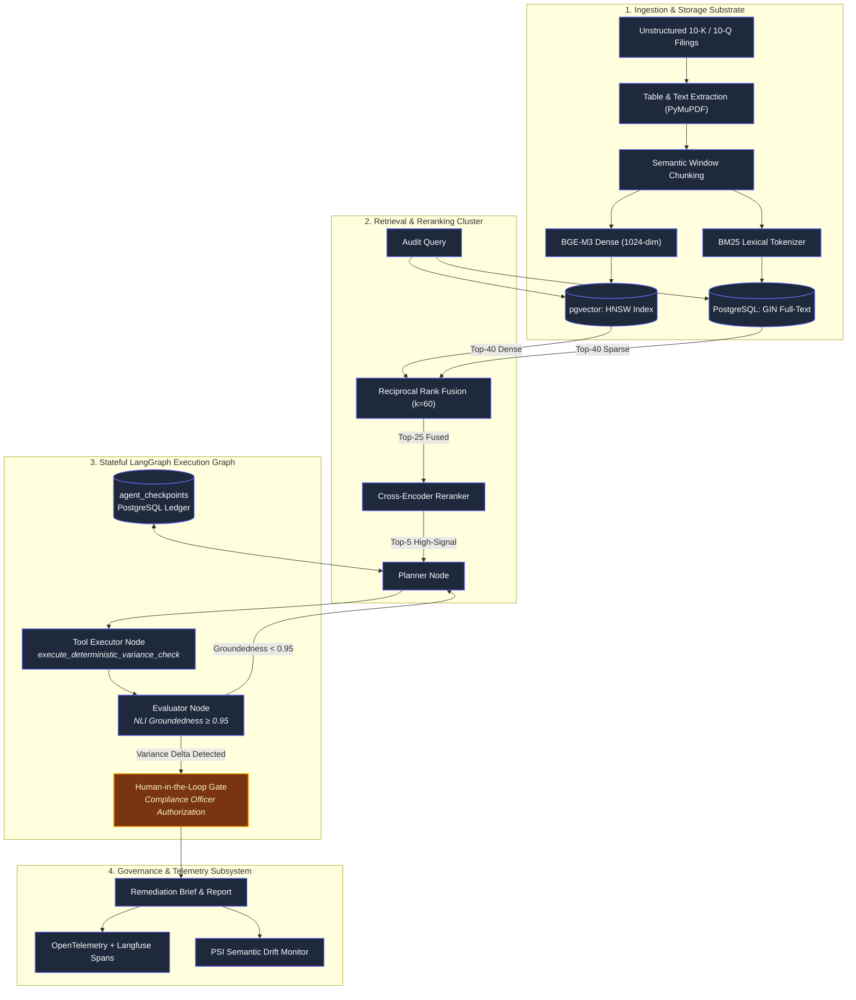

# CHAPTER 8: Capstone Project: The Autonomous Financial Risk and Compliance Auditor

## 8.1 System Blueprint & Architectural Scope

This capstone module synthesizes all seven preceding layers into a unified, production-grade enterprise system: an **Autonomous Financial Risk & Compliance Auditor**. 

The system processes unstructured SEC regulatory filings, corporate quarterly reports (10-Q/10-K), and transaction dispute logs, identifies non-compliant transactions or reporting variances, checks them against regulatory policies, and compiles human-audited remediation briefs.



---

## 8.2 Database Schemas: Relational, Vector & Memory

The storage substrate combines standard relational schemas, vector indexing via `pgvector`, and an append-only checkpoint ledger inside PostgreSQL.

### 8.2.1 Document Ingestion & Vector Schema

```sql
-- Enable necessary extensions
CREATE EXTENSION IF NOT EXISTS "uuid-ossp";
CREATE EXTENSION IF NOT EXISTS "vector";

-- Master Documents Table
CREATE TABLE financial_documents (
    document_id UUID PRIMARY KEY DEFAULT uuid_generate_v4(),
    ticker VARCHAR(10) NOT NULL,
    fiscal_year INT NOT NULL,
    fiscal_period VARCHAR(4) NOT NULL, -- 'Q1', 'Q2', 'Q3', 'FY'
    document_type VARCHAR(20) NOT NULL, -- '10-K', '10-Q', 'AUDIT_NOTE'
    source_url TEXT NOT NULL,
    created_at TIMESTAMP WITH TIME ZONE DEFAULT NOW()
);

-- Hybrid Search Chunks Table
CREATE TABLE document_chunks (
    chunk_id UUID PRIMARY KEY DEFAULT uuid_generate_v4(),
    document_id UUID REFERENCES financial_documents(document_id) ON DELETE CASCADE,
    chunk_index INT NOT NULL,
    content TEXT NOT NULL,
    parent_section_header TEXT NOT NULL,
    embedding VECTOR(1024), -- BGE-Large / Cohere dimension
    tsv_content TSVECTOR GENERATED ALWAYS AS (to_tsvector('english', content)) STORED,
    metadata JSONB NOT NULL DEFAULT '{}'::jsonb,
    created_at TIMESTAMP WITH TIME ZONE DEFAULT NOW()
);

-- HNSW Vector Index for Dense Cosine Search
CREATE INDEX idx_document_chunks_hnsw 
ON document_chunks 
USING hnsw (embedding vector_cosine_ops)
WITH (m = 16, ef_construction = 64);

-- Inverted GIN Index for BM25 / Sparse Full-Text Search
CREATE INDEX idx_document_chunks_tsv 
ON document_chunks 
USING gin (tsv_content);
```

### 8.2.2 State Checkpointer Persistence Schema (LangGraph Backend)

```sql
-- State Checkpointer Ledger
CREATE TABLE agent_checkpoints (
    thread_id UUID NOT NULL,
    checkpoint_id UUID NOT NULL,
    parent_checkpoint_id UUID,
    node_name VARCHAR(64) NOT NULL,
    state_payload JSONB NOT NULL,
    created_at TIMESTAMP WITH TIME ZONE DEFAULT NOW(),
    PRIMARY KEY (thread_id, checkpoint_id)
);

CREATE INDEX idx_checkpoints_lookup 
ON agent_checkpoints (thread_id, created_at DESC);
```

---

## 8.3 State Management & Data Contracts (Pydantic)

To maintain deterministic integrity across transitions, the agent state and tool parameters are governed by strict Pydantic definitions.

### 8.3.1 Graph State Definition

```python
from typing import TypedDict, List, Dict, Any, Optional, Annotated
import operator
from pydantic import BaseModel, Field

class Finding(BaseModel):
    policy_id: str = Field(..., description="ID of the infringed policy")
    discrepancy_amount: float = Field(..., description="Absolute variance in USD")
    variance_percentage: float = Field(..., description="Calculated percentage delta")
    source_citation: str = Field(..., description="Exact document and paragraph citation")
    severity: str = Field(..., regex=r"^(LOW|MEDIUM|HIGH|CRITICAL)$")

class AuditorState(TypedDict):
    # Session identifiers
    thread_id: str
    target_entity: str
    fiscal_scope: str
    
    # Message logs with append reducer
    messages: Annotated[List[Dict[str, str]], operator.add]
    
    # Internal variables
    retrieved_contexts: List[str]
    sql_query_to_run: Optional[str]
    raw_ledger_data: Optional[List[Dict[str, Any]]]
    identified_findings: Annotated[List[Finding], operator.add]
    
    # Control flags
    retry_count: int
    groundedness_score: float
    requires_human_approval: bool
    current_status: str
```

### 8.3.2 Production Sandboxed Tool Contracts

```python
class LedgerSQLQueryInput(BaseModel):
    merchant_id: str = Field(..., regex=r"^MER-[0-9]{4}-[A-Z0-9]{4}$")
    fiscal_quarter: str = Field(..., regex=r"^202[0-9]-Q[1-4]$")
    aggregate_by: str = Field(..., regex=r"^(MONTH|CATEGORY|CURRENCY)$")
    row_limit: int = Field(default=50, ge=1, le=100)

class DeterministicVarianceCalcInput(BaseModel):
    stated_total: float = Field(..., description="Number extracted from SEC filing text")
    calculated_sum: float = Field(..., description="Sum derived from raw transaction rows")
    tolerance_threshold: float = Field(default=0.005, description="Allowed rounding variance (0.5%)")

class DeterministicVarianceCalcOutput(BaseModel):
    variance_abs: float
    variance_pct: float
    is_breached: bool
    formula_trace: str
```

---

## 8.4 Deterministic Tool Implementation & Sandboxing

The agent is never permitted to perform mental math or execute raw unchecked database strings.

```python
def execute_deterministic_variance_check(inputs: DeterministicVarianceCalcInput) -> DeterministicVarianceCalcOutput:
    """Executes float math in a sandboxed, deterministic runtime."""
    stated = inputs.stated_total
    actual = inputs.calculated_sum
    
    variance_abs = round(abs(stated - actual), 4)
    variance_pct = round((variance_abs / (stated if stated != 0 else 1.0)), 6)
    is_breached = variance_pct > inputs.tolerance_threshold
    
    trace = f"|{stated} - {actual}| = {variance_abs} -> ({variance_abs} / {stated}) = {variance_pct * 100:.4f}%"
    
    return DeterministicVarianceCalcOutput(
        variance_abs=variance_abs,
        variance_pct=variance_pct,
        is_breached=is_breached,
        formula_trace=trace
    )
```

---

## 8.5 State Graph Orchestration Logic

The engine executes as a state machine containing planning, tool calling, automated evaluation, and interrupt gates.

```python
from langgraph.graph import StateGraph, END

# Initialize State Machine Builder
builder = StateGraph(AuditorState)

# 1. Define Nodes
def planner_node(state: AuditorState) -> Dict[str, Any]:
    """Analyzes the audit scope, inspects findings, and decides the next action."""
    # Invokes base LLM with system prompts & tool definitions
    return {"current_status": "RETRIEVING_CONTEXT", "retry_count": state["retry_count"]}

def retrieval_node(state: AuditorState) -> Dict[str, Any]:
    """Runs Hybrid Dense + Sparse Search via SQL engine and passes results to Reranker."""
    # Executes Chapter 4 RRF search pipeline
    return {"retrieved_contexts": ["Chunk 1...", "Chunk 2..."], "current_status": "EXECUTING_TOOLS"}

def tool_execution_node(state: AuditorState) -> Dict[str, Any]:
    """Executes Pydantic-validated deterministic tools against read-replicas."""
    # Runs execute_deterministic_variance_check
    return {"current_status": "EVALUATING_FINDINGS"}

def groundedness_eval_node(state: AuditorState) -> Dict[str, Any]:
    """Computes Groundedness score (Chapter 7) using NLI checks."""
    score = 0.98 # Calculated dynamically via LLM-as-a-Judge
    return {
        "groundedness_score": score,
        "requires_human_approval": score >= 0.95 and len(state["identified_findings"]) > 0,
        "current_status": "AUDIT_READY" if score >= 0.95 else "FAILED_EVAL"
    }

def human_approval_gate(state: AuditorState) -> Dict[str, Any]:
    """Suspension point. Graph persists state and emits webhook."""
    return {"current_status": "COMPLETED"}

# 2. Add Nodes to Graph
builder.add_node("planner", planner_node)
builder.add_node("retriever", retrieval_node)
builder.add_node("tool_executor", tool_execution_node)
builder.add_node("evaluator", groundedness_eval_node)
builder.add_node("human_gate", human_approval_gate)

# 3. Define Edges and Conditional Transitions
builder.set_entry_point("planner")
builder.add_edge("planner", "retriever")
builder.add_edge("retriever", "tool_executor")
builder.add_edge("tool_executor", "evaluator")

def evaluate_transition(state: AuditorState) -> str:
    if state["groundedness_score"] < 0.95:
        if state["retry_count"] < 3:
            return "retry_planner"
        return "abort_to_failure"
    if state["requires_human_approval"]:
        return "require_hitl"
    return "finalize"

builder.add_conditional_edges(
    "evaluator",
    evaluate_transition,
    {
        "retry_planner": "planner",
        "abort_to_failure": END,
        "require_hitl": "human_gate",
        "finalize": END
    }
)

# Interrupt condition for Human-in-the-Loop
graph = builder.compile(interrupt_before=["human_gate"])
```

---

## 8.6 Telemetry, Drift & Automated Regression Testing

### 8.6.1 CI/CD Evaluation Pipeline (`test_rag_pipeline.py`)

Every pull request runs deterministic and probabilistic evaluation assertions prior to model/prompt deployment:

```python
import pytest
from ragas.metrics import faithfulness, context_recall, answer_relevance

def test_audit_rag_pipeline_regression():
    # Load gold-standard baseline dataset
    test_cases = [
        {
            "query": "What was the variance in merchant M-881 adjustment reserves?",
            "ground_truth_context": "Merchant M-881 adjustment reserves increased by $1.2M due to legacy arbitration.",
            "ground_truth_answer": "The variance was an increase of $1.2M."
        }
    ]
    
    for case in test_cases:
        result = run_full_agent_pipeline(case["query"])
        
        # 1. Assert Schema Conformance
        assert isinstance(result["identified_findings"], list)
        
        # 2. Assert Quality Thresholds
        faithfulness_score = faithfulness.score(result, case)
        assert faithfulness_score >= 0.95, f"Faithfulness dropped to {faithfulness_score}"
        
        context_score = context_recall.score(result, case)
        assert context_score >= 0.90, f"Context recall failed: {context_score}"
```

### 8.6.2 Population Stability Index (PSI) Drift Monitor

An automated scheduled cron job computes vector drift across production queries:

```python
import numpy as np

def calculate_embedding_drift_psi(baseline_embeddings: np.ndarray, production_embeddings: np.ndarray, buckets: int = 10) -> float:
    """Computes PSI across high-dimensional centroid distances to detect semantic drift."""
    # Compute centroid of baseline
    baseline_centroid = np.mean(baseline_embeddings, axis=0)
    
    # Calculate cosine distances to centroid
    base_dists = 1.0 - np.dot(baseline_embeddings, baseline_centroid)
    prod_dists = 1.0 - np.dot(production_embeddings, baseline_centroid)
    
    # Create quantile buckets
    quantiles = np.linspace(0, 100, buckets + 1)
    bins = np.percentile(base_dists, quantiles)
    bins[0] = -np.inf
    bins[-1] = np.inf
    
    base_counts, _ = np.histogram(base_dists, bins=bins)
    prod_counts, _ = np.histogram(prod_dists, bins=bins)
    
    base_pct = np.clip(base_counts / len(base_dists), 1e-4, 1.0)
    prod_pct = np.clip(prod_counts / len(prod_dists), 1e-4, 1.0)
    
    psi = np.sum((prod_pct - base_pct) * np.log(prod_pct / base_pct))
    return float(psi)
```

---

## 8.7 Complete Production Verification Checklist

Before issuing production access keys, this checklist must be satisfied:

### 1. Ingestion & Storage Architecture
- [ ] Database read-replicas configured with a dedicated read-only role (`GRANT SELECT ON ...`).
- [ ] HNSW vector indexes indexed with `vector_cosine_ops` using `m=16` and `ef_construction=64`.
- [ ] Document chunks include full AST structural breadcrumb headers (`Chapter > Section > Subheading`).
- [ ] Inverted Full-Text search indexes (`gin (tsv_content)`) configured with language-appropriate stemming dictionaries.

### 2. Retrieval & Reranking Cluster
- [ ] Dense search and Sparse BM25 combined using Reciprocal Rank Fusion with $k=60$.
- [ ] Cross-Encoder reranker deployed with batch size limits to cap P99 latency below 350ms.
- [ ] Maximum retrieved candidates into reranker capped at 50 records.

### 3. Agentic Orchestration & Determinism
- [ ] All tool inputs and outputs strictly bound to Pydantic models.
- [ ] Zero arbitrary code execution paths; calculations offloaded to sandboxed scalar functions.
- [ ] State Graph initialized with a persistent PostgreSQL checkpointer for session recovery.
- [ ] Recursion limits strictly capped at `max_iterations = 8`.
- [ ] All high-risk mutations guarded with an explicit `interrupt_before` approval gate.

### 4. Serving Infrastructure & Sizing
- [ ] Runtimes configured with PagedAttention and continuous iteration batching (vLLM / TensorRT-LLM).
- [ ] Total KV cache footprint sized to fit within GPU VRAM with a 20% buffer for peak concurrency.
- [ ] Models quantized using AWQ (W4A16) or native FP8 (E4M3) with verified zero-loss regression.
- [ ] Time-To-First-Token (TTFT) and Inter-Token Latency (ITL) instrumented with OpenTelemetry.

### 5. Safety, Governance & Compliance (EU AI Act)
- [ ] Delimiter Sandboxing applied to all untrusted document ingestion strings.
- [ ] Input classifiers active to intercept direct and indirect prompt injection attempts.
- [ ] Groundedness evaluation filter halts and escalates responses scoring below 0.95.
- [ ] Automated PSI monitoring configured with alerting thresholds set at $\text{PSI} \ge 0.15$.
- [ ] Audit trails (thread ID, checkpoint state, prompt git SHA, model snapshot) stored for regulatory compliance under Article 12 & 14.
