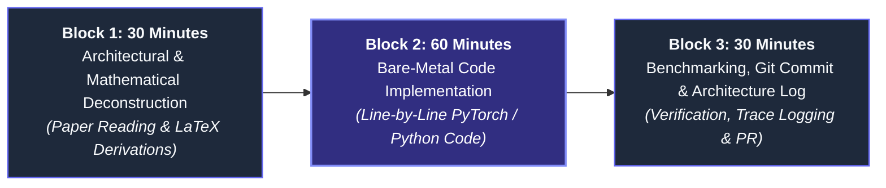

# CHAPTER 9: The Accelerated Fast-Track Roadmap — The 60-Day / 8-Week AI Engineering Hyper-Sprint

## 9.1 Architectural Overview & Sprint Philosophy

Traditional academic or corporate training paths allocate **9 to 12 months** to learn modern artificial intelligence. In practice, long timelines foster "tutorial hell": learners passively watch video walkthroughs, rely on bloated orchestration frameworks that obscure the underlying mechanics, and forget early math by the time they reach deployment.

The **Accelerated Fast-Track Roadmap** compresses this trajectory into an aggressive, intensive **8-Week (60-Day) Hyper-Sprint**. This compression is achieved through three core engineering principles:

1. **First-Principles Implementation (Zero Black-Box Wrappers):** You do not start by importing high-level abstractions like LangChain or AutoTrain. You construct tokenizers, scaled dot-product attention, LoRA projection layers, and state machines from bare mathematical primitives in PyTorch and Python.
2. **The 30-60-30 Daily Deliberate Practice Protocol:** Every single working day is divided into three non-negotiable operational blocks totaling 2 hours of focused output.
3. **Verifiable Gate Milestones (Exit Criteria):** Progression between sprint phases is gated by automated test suites and production deployments—not by hours watched or chapters read.

```mermaid
flowchart TD
    subgraph Phase1 ["Phase 1: Foundations (Days 1–14)"]
        P1A["Tensors, Strides & Memory Layouts"] --> P1B["Byte-level BPE Tokenizer from Scratch"]
        P1B --> P1C["Embedding Matrix & RoPE Coordinate Math"]
        P1C --> P1D["Scaled Dot-Product & Causal Attention"]
        P1D --> Gate1{{"Gate 1: Bare-Metal Transformer Decoder Block"}}
    end

    subgraph Phase2 ["Phase 2: Adaptation (Days 15–28)"]
        Gate1 --> P2A["Cross-Entropy Loss & AdamW Memory Wall"]
        P2A --> P2B["LoRA Low-Rank Decomposition (W0 + BA)"]
        P2B --> P2C["QLoRA NormalFloat4 (NF4) Quantization"]
        P2C --> P2D["Preference Alignment (DPO vs. RLHF)"]
        P2D --> Gate2{{"Gate 2: Fine-Tuned 8B Schema Engine on 1 GPU"}}
    end

    subgraph Phase3 ["Phase 3: Retrieval & Agents (Days 29–42)"]
        Gate2 --> P3A["Semantic Window Chunking & AST Parsing"]
        P3A --> P3B["pgvector HNSW + PostgreSQL BM25 Indexing"]
        P3B --> P3C["Reciprocal Rank Fusion & Cross-Encoders"]
        P3C --> P3D["LangGraph Stateful Cycles & Deterministic Tools"]
        P3D --> Gate3{{"Gate 3: Self-Correcting SQL Audit Agent with HITL"}}
    end

    subgraph Phase4 ["Phase 4: Serving & Capstone (Days 43–60)"]
        Gate3 --> P4A["vLLM Serving, PagedAttention & Roofline Model"]
        P4A --> P4B["The RAG Triad, NLI Evals & Guardrails"]
        P4B --> P4C["Capstone Assembly: Financial Auditor"]
        P4C --> P4D["EU AI Act Compliance & OpenTelemetry Spans"]
        P4D --> Gate4{{"Gate 4: Production Deployment & Live Audit Run"}}
    end

    classDef default fill:#1e293b,stroke:#6366f1,stroke-width:1.5px,color:#f8fafc;
    classDef gate fill:#78350f,stroke:#f59e0b,stroke-width:2px,color:#fef3c7;
    class Gate1,Gate2,Gate3,Gate4 gate;
```



---

## 9.2 The 30-60-30 Daily Deliberate Practice Protocol

To achieve industry-level fluency in 60 days, you must engage in high-intensity **deliberate practice**. Casual reading yields zero retention when debugging a distributed CUDA kernel or resolving an agentic state cycle under production load.



### The Three Execution Blocks:

#### Block 1: Architectural Deconstruction (30 Minutes)
- **Objective:** Dissect the day's foundational paper or mathematical equation before looking at high-level code.
- **Protocol:**
  1. Open the original research paper (e.g., Vaswani 2017 for Attention, Hu 2021 for LoRA, Dettmers 2023 for QLoRA).
  2. Re-derive the core mathematical equations on paper or an iPad using linear algebra notations:
     $$\text{Attention}(Q, K, V) = \text{softmax}\left(\frac{QK^T}{\sqrt{d_k}} + M\right)V$$
  3. Map every tensor dimension: shape of inputs, intermediate projection weights, stride configurations, and floating-point precision budgets.

#### Block 2: Bare-Metal Implementation (60 Minutes)
- **Objective:** Code the mathematical concept from scratch without high-level wrapper libraries.
- **Protocol:**
  1. Fire up a clean Python/PyTorch development file.
  2. Implement the algorithm line by line using raw tensors, matrix multiplications (`torch.matmul` or `@`), and boolean masks.
  3. Include strict assertion tests confirming output shapes, gradient backward-pass flows, and numeric boundary behavior (handling `NaN`, `Inf`, and zero divisions).

#### Block 3: Verification, Profiling & Public Commit (30 Minutes)
- **Objective:** Benchmark execution characteristics and log an immutable record of engineering output.
- **Protocol:**
  1. Profile VRAM allocation (`torch.cuda.memory_allocated()`) and runtime execution latency.
  2. Commit code to your public GitHub repository with an engineering post-mortem: *What broke? Why did the naive approach fail? What is the physical hardware constraint?*
  3. Tag the commit with the sprint day milestone (e.g., `Day 14: Completed Gate 1 - Bare-metal Transformer Decoder`).

---

## 9.3 Phase 1 (Days 1–14): The Mechanical Substrate & Core Linear Algebra

```text
Focus: Tensors, Memory Contiguity, Tokenizers, Embeddings, Positional Encoding & Self-Attention
Target Hardware: Standard laptop or 1x Google Colab Free T4 GPU
```

### Day-by-Day Execution Matrix:

| Day | Core Architectural Topic | Daily Deliverable & Implementation |
|---|---|---|
| **Day 1** | **Tensor Strides & Physical Storage** | Write a C-contiguous vs. Fortran-contiguous tensor benchmark in NumPy/PyTorch. Demonstrate how `tensor.view()` differs from `tensor.reshape()` in memory reallocation. |
| **Day 2** | **Byte Spectrum & Text Normalization** | Implement Unicode normalization (NFC/NFKC) and regex sub-word splitting rules. Deconstruct why naive character-level and word-level tokenizers fail. |
| **Day 3–4** | **Byte-Pair Encoding (BPE) from Scratch** | Code a complete BPE training algorithm: frequency counting, adjacent pair merging, and vocabulary construction. Train a 1,000-token custom tokenizer on financial reports. |
| **Day 5** | **The Embedding Layer ($W_E$) Mechanics** | Implement the embedding lookup as both a one-hot matrix multiplication and an $O(1)$ memory index scan. Benchmark the 1000x speedup of direct pointer offsets. |
| **Day 6** | **High-Dimensional Latent Geometry** | Calculate Dot Product, Euclidean Distance ($L_2$), and Cosine Similarity across embedding vectors. Demonstrate embedding anisotropy (The Cone Effect) on random vs. trained vectors. |
| **Day 7** | **Absolute vs. Relative Positional Encoding** | Derive the original sinusoidal positional encoding equations. Demonstrate mathematical failure when prompt sequence length exceeds the hard-coded training ceiling. |
| **Day 8–9** | **Rotary Position Embedding (RoPE)** | Implement RoPE 2D complex coordinate rotations in PyTorch. Prove mathematically that $\langle R_m q, R_n k \rangle$ depends strictly on relative offset $(n - m)$. |
| **Day 10** | **Linear Projections ($Q, K, V$)** | Code linear projections using PyTorch tensor contractions. Build the SQL relational join mental model linking Queries, Keys, and Values. |
| **Day 11** | **Scaled Dot-Product & Gradient Saturation** | Implement $\text{softmax}(QK^T / \sqrt{d_k})$. Run numeric simulations demonstrating how omitting $\sqrt{d_k}$ pushes softmax gradients to zero when $d_k = 128$. |
| **Day 12** | **Autoregressive Causal Masking** | Construct upper-triangular causal masks with $-\infty$. Verify that future tokens receive exactly $0.0$ attention weight after softmax normalization. |
| **Day 13** | **Grouped-Query Attention (GQA)** | Build a modular attention layer supporting Multi-Head Attention (MHA), Multi-Query Attention (MQA), and Grouped-Query Attention (GQA). Compute KV cache savings. |
| **Day 14** | **GATE 1 MILESTONE** | **Synthesize a working 4-layer Decoder-Only Transformer block from scratch.** Validate forward generation on a toy corpus with loss backpropagation. |

---

## 9.4 Phase 2 (Days 15–28): Efficient Adaptation & Optimization

```text
Focus: Loss Functions, AdamW Memory Footprint, LoRA, QLoRA (NF4) & Alignment (DPO)
Target Hardware: 1x Consumer GPU (RTX 3090, 4090, or Colab A100)
```

### Day-by-Day Execution Matrix:

| Day | Core Architectural Topic | Daily Deliverable & Implementation |
|---|---|---|
| **Day 15** | **Cross-Entropy Loss & Softmax Calculus** | Derive cross-entropy loss from negative log-likelihood. Implement perplexity calculation ($PPL = e^{\mathcal{L}_{\text{CE}}}$) and analyze loss spikes during training. |
| **Day 16** | **Backpropagation & The Error Chain Rule** | Trace the multivariate calculus chain rule through an attention block. Compute exact weight gradients ($\partial \mathcal{L} / \partial W$) manually. |
| **Day 17** | **AdamW Optimizer States & The Memory Wall** | Implement AdamW momentum ($m_t$) and variance ($v_t$) tracking. Write the exact calculation proving why a 70B model requires 1,120 GB VRAM for full 16-bit fine-tuning. |
| **Day 18** | **The Intrinsic Rank Hypothesis** | Perform Singular Value Decomposition (SVD) on weight update matrices ($\Delta W$). Prove that 90%+ of update variance is captured in rank $r \le 16$. |
| **Day 19–20** | **LoRA Implementation from Scratch** | Build a custom `LoRALinear` layer in PyTorch: freeze $W_0$, initialize $A \sim \mathcal{N}(0, \sigma^2)$ and $B = 0$, apply scaling $\frac{\alpha}{r}$. Train on an instruction dataset. |
| **Day 21** | **Weight Merging & Zero-Latency Inference** | Implement the mathematical weight collapse: $W_{\text{prod}} = W_0 + \frac{\alpha}{r}(BA)$. Verify that the merged model produces identical outputs with zero runtime latency overhead. |
| **Day 22** | **Block Quantization & Dynamic Scaling** | Implement standard FP16 to INT8 block quantization. Compute scale factors ($S = \text{absmax}(X) / 127$) and measure quantization error on weight activations. |
| **Day 23–24** | **QLoRA: NormalFloat4 (NF4) Mechanics** | Deconstruct NormalFloat4 information-theoretically. Implement Double Quantization and analyze Paged Optimizers for offloading spike activations to CPU RAM. |
| **Day 25** | **Supervised Fine-Tuning (SFT) Data ETL** | Build a high-throughput JSONL data pipeline with packing: concatenate multiple conversations up to max sequence length to eliminate padding token compute waste. |
| **Day 26–27** | **Preference Alignment: DPO vs. RLHF** | Derive the Direct Preference Optimization (DPO) loss equation from the Bradley-Terry preference model: $\mathcal{L}_{\text{DPO}} = -\log \sigma \left(\beta \log \frac{\pi_\theta(y_w \mid x)}{\pi_{\text{ref}}(y_w \mid x)} - \beta \log \frac{\pi_\theta(y_l \mid x)}{\pi_{\text{ref}}(y_l \mid x)}\right)$. |
| **Day 28** | **GATE 2 MILESTONE** | **Adapt an open-source 8B foundation model using QLoRA on a single GPU.** Enforce strict, valid Pydantic JSON schema generation with zero syntax errors. |

---

## 9.5 Phase 3 (Days 29–42): Production Hybrid Retrieval & Stateful Agent Graphs

```text
Focus: Chunking ETL, pgvector HNSW, BM25, RRF, Cross-Encoders & LangGraph State Machines
Target Infrastructure: PostgreSQL with pgvector, Python 3.11+, LangGraph
```

### Day-by-Day Execution Matrix:

| Day | Core Architectural Topic | Daily Deliverable & Implementation |
|---|---|---|
| **Day 29** | **Semantic Window Chunking & AST Parsing** | Build an ingestion parser using PyMuPDF and Markdown AST tokenizers. Implement structural breadcrumb injection (`Document > Chapter > Section > Paragraph`). |
| **Day 30** | **Embedding Generation & Batching** | Generate dense vector embeddings using BGE-M3 (1,024-dim). Measure embedding generation throughput across varying batch sizes and context lengths. |
| **Day 31** | **pgvector HNSW Graph Configuration** | Deploy PostgreSQL with `pgvector`. Configure HNSW index hyperparameters: `m = 16`, `ef_construction = 64`. Benchmark query latency vs. recall. |
| **Day 32** | **Sparse Lexical Search: BM25 in PostgreSQL** | Configure PostgreSQL Full-Text Search with `tsv_content TSVECTOR` and GIN indexing. Benchmark keyword precision on numeric codes, invoice IDs, and acronyms. |
| **Day 33** | **Reciprocal Rank Fusion (RRF) Pipeline** | Code the RRF aggregation algorithm: $\text{RRF}(d) = \sum_{m \in M} \frac{1}{k + r_m(d)}$ with $k=60$. Combine Top-40 dense and Top-40 sparse candidates into Top-25 fused results. |
| **Day 34** | **Cross-Encoder Reranking Optimization** | Deploy a cross-encoder reranker (`bge-reranker-large`). Benchmark latency tradeoffs: reranking Top-25 vs. Top-100 candidates to maintain P99 latency below 350ms. |
| **Day 35** | **Lost-in-the-Middle Context Packing** | Implement context injection ordering: place the highest-scoring reranked chunks at the extreme beginning and extreme end of the prompt window to maximize attention weights. |
| **Day 36** | **State Graph Primitives & Schema Contracts** | Define an agent state schema using `TypedDict` and Pydantic models. Implement append-only reducer operations (`Annotated[List, operator.add]`). |
| **Day 37** | **Deterministic Tool Sandboxing** | Implement isolated tool functions with strict Pydantic inputs/outputs. Disallow all arbitrary Python `eval()` executions in favor of deterministic scalar logic. |
| **Day 38** | **Cyclic State Graph Construction** | Build a cyclic LangGraph state machine: Planner Node $\rightarrow$ Tool Execution Node $\rightarrow$ Evaluation Node. Connect conditional edges for autonomous error recovery. |
| **Day 39** | **PostgreSQL State Checkpoint Ledger** | Connect a PostgreSQL checkpointer (`agent_checkpoints`). Verify that agent state is persisted immutably after every node execution for session replay. |
| **Day 40** | **Human-in-the-Loop (HITL) Gate** | Implement an explicit `interrupt_before` breakpoint on mutation actions. Build state resumption logic triggered by an external compliance officer webhook. |
| **Day 41** | **Agent Self-Correction & Loop Limits** | Implement a syntax repair feedback loop: when a tool fails, route error trace back to the planner, increment `retry_count`, and cap recursion at `max_iterations = 8`. |
| **Day 42** | **GATE 3 MILESTONE** | **Deploy an end-to-end self-correcting financial SQL agent.** The agent must accept unstructured queries, generate SQL, fix syntax errors autonomously, and pause at a HITL gate. |

---

## 9.6 Phase 4 (Days 43–60): High-Throughput Serving, Evals & Production Capstone

```text
Focus: vLLM, PagedAttention, The RAG Triad, Guardrails, EU AI Act & Capstone Deployment
Target Infrastructure: Multi-GPU or Cloud Instance (RunPod / Lambda Labs / Vercel)
```

### Day-by-Day Execution Matrix:

| Day | Core Architectural Topic | Daily Deliverable & Implementation |
|---|---|---|
| **Day 43** | **LLM Inference Compute Regimes** | Profile Prefill (compute-bound) vs. Decode (memory-bandwidth bound) on physical hardware. Plot the Roofline Model for your target GPU architecture. |
| **Day 44** | **PagedAttention & Virtual Memory Translation** | Deconstruct vLLM block allocation. Implement a software simulation of logical-to-physical block mapping tables, demonstrating recovery of 60–80% wasted VRAM. |
| **Day 45** | **Continuous Iteration-Level Batching** | Deploy a serving engine with dynamic request insertion and eviction. Benchmark throughput (tokens/sec) vs. static lockstep batching under variable query lengths. |
| **Day 46** | **Production Quantization (AWQ & FP8)** | Quantize an 8B/70B model to AWQ (4-bit) and FP8 (E4M3). Measure latency improvement, VRAM footprint reduction, and run perplexity benchmarks. |
| **Day 47** | **The RAG Triad: Automated Metric Suite** | Implement automated scoring pipelines for Context Relevance, Groundedness (NLI proposition decomposition), and Answer Relevance using Ragas. |
| **Day 48** | **LLM-as-a-Judge Calibration** | Engineer calibrated judge prompts: anchored integer rubrics, permutation swapping (position invariance), and chain-of-thought extraction before scoring. |
| **Day 49** | **Adversarial Ingress Guardrails** | Implement Delimiter Sandboxing (`<UNTRUSTED_DOCUMENT_PAYLOAD>`) and deploy a fast ingress classifier (Llama-Guard) to intercept direct and indirect prompt injections. |
| **Day 50** | **Output Egress Scanners & Redaction** | Build regex and checksum scanners (Luhn algorithm) at API egress to intercept leaked credit card numbers, SSNs, and system prompt tokens before delivery. |
| **Day 51** | **Semantic Drift Monitoring (PSI)** | Implement a scheduled cron job computing Population Stability Index (PSI) over high-dimensional query embeddings. Set automated alerts for $\text{PSI} \ge 0.15$. |
| **Day 52** | **OpenTelemetry Distributed Tracing** | Instrument generation pipelines with OpenTelemetry spans: trace `prompt_tokens`, `completion_tokens`, TTFT, ITL, tool execution times, and USD cost attribution. |
| **Day 53–56** | **Capstone Construction: Financial Risk Auditor** | Assemble all layers into the Capstone Architecture (Chapter 8): Ingestion $\rightarrow$ Hybrid pgvector Index $\rightarrow$ LangGraph Machine $\rightarrow$ Evals $\rightarrow$ Telemetry Sink. |
| **Day 57** | **EU AI Act & Governance Compliance** | Author the technical documentation required under Articles 9–14 for High-Risk AI systems: data lineage audit, risk management file, and human oversight architecture. |
| **Day 58** | **End-to-End Automated Regression Suite** | Build a CI/CD test suite (`pytest`) executing 50 gold-standard audit scenarios. Enforce zero regression: Groundedness $\ge 0.95$ and Schema Validity $= 100\%$. |
| **Day 59** | **Load Testing & Latency SLA Profiling** | Run Locust load tests simulating 30 concurrent users. Profile P95 Time-To-First-Token (TTFT) and verify that KV cache allocation never triggers page thrashing. |
| **Day 60** | **GATE 4 CAPSTONE COMPLETION** | **Deploy the production system live.** Publish the codebase, benchmark reports, and interactive demo. Tag production release `v1.0.0`. |

---

## 9.7 Cognitive Operating System & Debugging Protocols

When undergoing an intensive 60-day sprint, you will inevitably hit cognitive and technical walls. Use these diagnostic checklists to unblock execution immediately:

### 1. The Tensor Dimension & Matrix Multiplication Mismatch
- **Symptom:** `RuntimeError: The size of tensor a (512) must match the size of tensor b (128) at non-singleton dimension 2`.
- **Diagnostic:** Print `tensor.shape` and `tensor.stride()` before every matrix multiplication. Write the algebraic dimension contract on paper:
  $$(B, H, S, d_k) \times (B, H, d_k, S) \longrightarrow (B, H, S, S)$$
- **Rule:** Never use `tensor.view()` without verifying that memory is contiguous. Call `tensor.contiguous()` if strides were altered by transpose operations.

### 2. CUDA Out-Of-Memory (`CUDA OOM`) During Decode
- **Symptom:** Runtimes crash during autoregressive generation even when initial prefill succeeded.
- **Diagnostic:** The static model weights fit, but dynamic KV cache accumulation exceeded remaining VRAM headroom.
- **Rule:** Calculate exact KV cache overhead using the Universal Formula:
  $$\text{KV VRAM (GB)} = \frac{2 \times \text{Bytes} \times n_{\text{layers}} \times n_{\text{heads\_kv}} \times d_{\text{head}} \times S \times B}{10^9}$$
  If running consumer hardware, switch from MHA to GQA, quantize KV cache to FP8, or enforce PagedAttention block pooling.

### 3. Agentic Infinite Looping
- **Symptom:** The state machine repeatedly loops between Planner and Tool Executor without reaching completion.
- **Diagnostic:** The tool returned an error string that the LLM cannot parse, or the conditional edge transition function lacks an incrementing escape hatch.
- **Rule:** Every state machine must include an explicit `retry_count` integer in its state schema. The conditional edge must strictly route to an abort/escalate node when `retry_count >= 3`.

---

## 9.8 Chapter Summary Checkpoint

1. **The 60-Day Sprint** succeeds by eliminating black-box wrappers and building from raw mathematical and tensor primitives.
2. **The 30-60-30 Protocol** balances theoretical deconstruction (30m), hands-on line-by-line implementation (60m), and verifiable benchmark logging (30m).
3. **Four Verifiable Gate Milestones** enforce mastery:
   - *Gate 1 (Day 14):* Bare-metal Decoder-only Transformer in PyTorch.
   - *Gate 2 (Day 28):* QLoRA fine-tuned 8B model with 100% Pydantic schema adherence.
   - *Gate 3 (Day 42):* Self-correcting LangGraph SQL agent with human approval breakpoint.
   - *Gate 4 (Day 60):* Full Capstone Financial Risk Auditor deployed with OpenTelemetry tracing and EU AI Act compliance.
