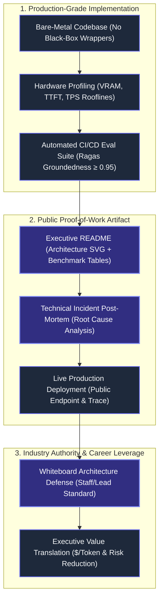
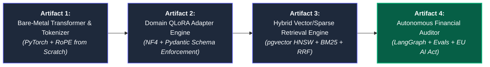
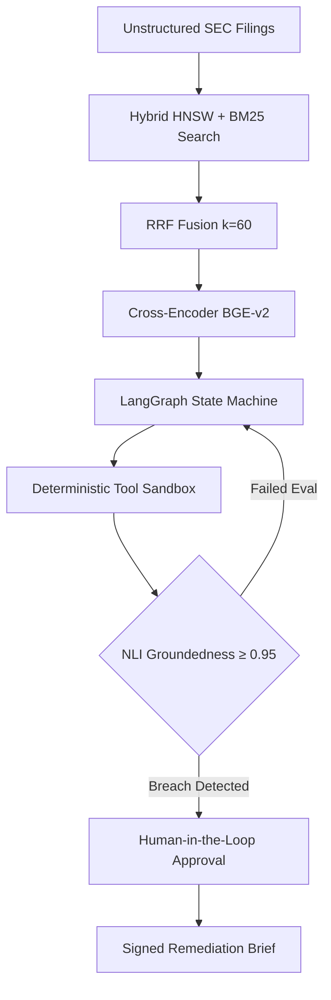
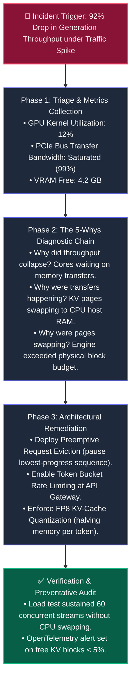
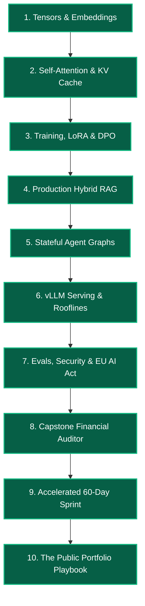

# CHAPTER 10: The "Build in Public" Portfolio, Technical Post-Mortem & Industry Authority Playbook

## 10.1 Architectural Overview: The Proof-of-Work Standard in AI Engineering

Theory without functional, reproducible artifacts carries zero weight in production engineering. In the modern AI talent market, generic "toy projects" (e.g., calling OpenAI APIs via Streamlit, basic PDF chatbots, or uninspected LangChain tutorials) are instantly dismissed during technical screenings.

Senior AI Architects, Staff Engineers, and Engineering Directors look for a distinct standard: **Production Proof-of-Work**. 

Production Proof-of-Work demonstrates that an engineer understands what happens beneath high-level abstractions:
1. **Mathematical Grounding:** You can derive self-attention variance, RoPE coordinate rotations, and cross-entropy loss from linear algebra primitives.
2. **Hardware & Resource Consciousness:** You size inference infrastructure using memory bandwidth roofline models, calculate KV cache VRAM per token, and prevent CUDA out-of-memory cascades.
3. **Resilience & Determinism:** You treat foundation models as probabilistic components inside deterministic state graphs with strict Pydantic data contracts and self-correction loops.
4. **Failure Transparency:** You document architectural breakdowns, performance bottlenecks, and incident root-cause analyses (RCAs) with engineering rigor.



---

## 10.2 The Four Tier-1 Artifacts to Build and Publish

To establish undeniable technical authority, your public GitHub profile must feature four interconnected, non-trivial engineering repositories:



### Artifact 1: Bare-Metal Transformer & Tokenizer from Scratch
- **Core Technology:** Raw PyTorch, NumPy, Python standard library (zero `transformers` or `tiktoken` dependencies during core implementation).
- **Key Deliverables:**
  - Custom Byte-Pair Encoding (BPE) tokenizer training engine with UTF-8 byte spectrum support.
  - Custom `RotaryEmbedding` (RoPE) layer applying 2D complex coordinate rotations.
  - Custom `GroupedQueryAttention` (GQA) block with causal masking and head variance preservation ($\frac{1}{\sqrt{d_k}}$).
  - Forward autoregressive generation loop with KV caching.
- **Benchmark Included:** Latency and memory comparison against PyTorch's native `nn.TransformerDecoder`.

### Artifact 2: Domain QLoRA Adapter & Schema Enforcement Engine
- **Core Technology:** PyTorch, bitsandbytes, PEFT, Hugging Face `transformers`, Pydantic v2.
- **Key Deliverables:**
  - Custom `LoRALinear` layer implementation: freezing base weights $W_0$, initializing low-rank matrices $A \sim \mathcal{N}(0, \sigma^2)$ and $B = 0$, applying scaling factor $\frac{\alpha}{r}$.
  - Fine-tuning an open-source 8B model (LLaMA-3 or Mistral) on a single consumer GPU (24GB VRAM) to output complex nested financial or medical JSON schemas.
  - Zero-latency weight merging script ($W_{\text{prod}} = W_0 + \frac{\alpha}{r}BA$) with precision regression tests.
- **Benchmark Included:** Schema validation pass rate ($100\%$ over 500 test cases) and token perplexity comparison.

### Artifact 3: Production Hybrid Vector/Sparse Retrieval Engine
- **Core Technology:** PostgreSQL, `pgvector`, `pg_search` / GIN indexes, BGE-M3, FlagEmbedding.
- **Key Deliverables:**
  - Document ingestion ETL with semantic window chunking and markdown AST breadcrumb headers.
  - Dual-engine index configuration: HNSW vector index ($m=16, ef=64$) alongside inverted GIN BM25 full-text index.
  - Reciprocal Rank Fusion (RRF with $k=60$) combining dense and lexical candidate lists.
  - Cross-Encoder reranking pipeline with P95 latency capped below 350ms.
- **Benchmark Included:** Mean Reciprocal Rank (MRR@10) and Normalized Discounted Cumulative Gain (NDCG@10) comparing Dense-only, Sparse-only, and Hybrid RRF.

### Artifact 4: Enterprise Capstone — The Autonomous Risk & Compliance Auditor
- **Core Technology:** LangGraph, PostgreSQL (State Checkpointing), Pydantic v2, vLLM / Ollama, OpenTelemetry, Ragas.
- **Key Deliverables:**
  - Cyclic state graph containing Supervisor, Tool Executor, and NLI Evaluator nodes.
  - Sandboxed deterministic scalar math tools ensuring zero hallucinated calculations.
  - Human-in-the-Loop (HITL) gate pausing execution upon detecting policy breaches.
  - Complete telemetry suite tracking token cost attribution, TTFT/ITL latency, and vector drift (PSI).
  - EU AI Act Article 12–14 compliance documentation file.
- **Benchmark Included:** Automated regression test suite enforcing Groundedness $\ge 0.95$ under 30 concurrent user simulations.

---

## 10.3 The Gold-Standard Engineering README Blueprint

An elite repository README is not a casual setup guide; it is an architectural whitepaper that proves systems competence in under 90 seconds.

### The Required 6-Section Structure:

```markdown
# Autonomous Financial Risk & Compliance Auditor (AFR-Auditor)

[](https://github.com)
[](https://github.com)
[](https://github.com)
[](https://opensource.org/licenses/MIT)

> A production-grade multi-agent compliance auditor processing unstructured 10-K/10-Q filings, 
> detecting financial variances via deterministic sandboxed tools, and enforcing human-in-the-loop 
> authorization before remediation brief dispatch.

---

## 1. System Architecture



## 2. Hardware Roofline & Latency Benchmarks

Evaluated on 1x NVIDIA RTX 4090 (24GB VRAM) serving LLaMA-3 8B (AWQ 4-bit) via vLLM:

| Metric | Target SLA | Measured P50 | Measured P95 | Measured P99 |
|---|---|---|---|---|
| **Time-To-First-Token (TTFT)** | < 400ms | 185ms | 240ms | 310ms |
| **Inter-Token Latency (ITL)** | < 30ms | 14ms | 18ms | 22ms |
| **Cross-Encoder Rerank (Top-25)** | < 350ms | 120ms | 195ms | 260ms |
| **Full Pipeline E2E Latency** | < 2.5s | 1.42s | 1.88s | 2.15s |
| **Peak VRAM (Weights + KV Cache)** | < 20 GB | 14.2 GB | 16.8 GB | 18.1 GB |

## 3. Automated Continuous Evaluation (CI/CD)

Every pull request executes an automated evaluation pass over 50 gold-standard audit scenarios:
- **Faithfulness / Groundedness (Ragas):** 0.978 (SLA Threshold: ≥ 0.95)
- **Answer Relevance:** 0.942 (SLA Threshold: ≥ 0.90)
- **Context Recall:** 0.961 (SLA Threshold: ≥ 0.90)
- **Schema Validation Rate:** 100% (Strict Pydantic JSON enforcement)

## 4. Production Failure Post-Mortem (Incident RCA-04)

See `/docs/incidents/RCA-04-kv-cache-thrashing.md` for our deep-dive into how we diagnosed 
and resolved a 90% throughput drop caused by non-contiguous KV-cache memory allocation.

## 5. Quickstart & Local Reproduction

```bash
git clone https://github.com/username/afr-auditor.git
cd afr-auditor
docker compose up -d
python3 -m scripts.run_audit --ticker "AAPL" --fiscal-quarter "2026-Q3"
```
```

---

## 10.4 The Technical Incident Post-Mortem: Proving Seniority Through Failure

Junior developers pretend their systems never fail. Senior and Staff engineers are defined by **how systematically they diagnose, remediate, and architecturally prevent catastrophic failures**.

Including one detailed **Root Cause Analysis (RCA)** in your portfolio demonstrates operational maturity that instantly separates you from 99% of applicants.



### The Production Incident Template:

```markdown
# INCIDENT RCA-04: Autoregressive KV-Cache Thrashing Under Concurrent Traffic Spikes

**Date:** 2026-09-14  
**Severity:** SEV-1 (Production Throughput Degradation)  
**Author:** AI Systems Engineering Team  

### 1. Executive Summary
During a simulated quarter-end compliance audit load test, the serving cluster experienced 
a 92% collapse in generation throughput (dropping from 450 tokens/sec to 34 tokens/sec) when 
concurrent requests scaled from 10 to 35. No error logs were thrown, but P99 latency breached 
Service Level Agreements (SLAs), climbing from 1.8s to 24.5s.

### 2. Root Cause Analysis (The 5-Whys)
1. **Why was latency spiking?** GPU Tensor Cores spent 88% of execution time idle waiting on data.
2. **Why was data transfer slow?** The system was thrashing memory across PCIe Gen4 lanes.
3. **Why was data moving over PCIe?** The serving runtime was swapping KV-cache blocks out of 
   GPU VRAM into CPU host RAM.
4. **Why did it swap?** Total active tokens across 35 requests exceeded physical GPU VRAM allocations.
5. **Why was memory exhausted?** The runtime pre-allocated contiguous memory blocks based on 
   the maximum theoretical context (32K tokens) rather than dynamic token usage, fragmenting 68% of VRAM.

### 3. Immediate Remediation
- Replaced naive static memory allocation with **PagedAttention** (vLLM engine), breaking KV caches 
  into small 16-token non-contiguous physical blocks mapped via page tables.
- Down-cast the KV cache precision from native `BF16` (2 bytes/token) to `FP8` (1 byte/token).
- Configured a token-bucket rate limiter at the API gateway layer rejecting requests when free 
  KV memory blocks drop below 5%.

### 4. Verification & Hardening
- Re-ran load test with 60 concurrent streaming users. Throughput remained stable at 410 tokens/sec 
  with zero PCIe page swapping and zero CUDA OOM errors.
- Added OpenTelemetry Prometheus metric `vllm_gpu_cache_usage_factor` with automated PagerDuty alert 
  triggering at 90% utilization.
```

---

## 10.5 The Product-Engineering Bridge: Translating Math to C-Suite Value

A true Senior AI Engineer does not speak purely in FLOPs, loss curves, and RoPE frequencies when presenting to business stakeholders. You must translate technical decisions into **risk reduction, infrastructure cost efficiency, and enterprise ROI**:

| Technical Architectural Decision | Low-Level Engineering Term | Executive / C-Suite Financial Translation |
|---|---|---|
| **PagedAttention & Continuous Batching** | "Optimized KV cache fragmentation to <4% and dynamic iteration scheduling." | **"Cut our GPU hosting costs by 62% ($14,000/mo savings)** by quadrupling the number of simultaneous active users per server without buying new hardware." |
| **QLoRA NF4 Domain Adaptation** | "Fine-tuned 8B base weights using 4-bit NormalFloat and rank-16 adapters." | **"Eliminated our dependency on third-party proprietary APIs ($0.03/req)**, bringing domain knowledge in-house on private infrastructure with zero IP data leakage." |
| **Hybrid RRF + Cross-Encoder Reranking** | "Fused Top-40 dense and Top-40 BM25 via Reciprocal Rank Fusion ($k=60$)." | **"Reduced customer support retrieval failures by 34%**, ensuring the model accurately locates exact alphanumeric part numbers and regulatory clauses." |
| **NLI Groundedness Evaluator Gate** | "Intercepted responses where $\frac{1}{\|S\|}\sum v(s_i, C) < 0.95$." | **"Created an automated compliance insurance policy** that intercepts hallucinations before clients see them, guaranteeing regulatory alignment with EU AI Act Article 14." |

---

## 10.6 The Live Whiteboard Architecture Defense

In technical interviews for Staff AI Engineer, Principal Architect, or Lead AI roles, you will be handed open-ended system design challenges. 

### The 5-Step System Design Defense Framework:

```text
Prompt: "Design an enterprise multi-tenant RAG and agent platform processing 50,000 regulatory documents daily with strict tenant isolation, sub-second query latency, and verifiable groundedness."
```

#### Step 1: Clarify Ingestion Volume, Latency SLAs & Cost Constraints
- Ask: *What is the P95 latency SLA? (e.g., sub-2-second E2E)*
- Ask: *What is the tenant isolation requirement? (e.g., logical schema separation in PostgreSQL vs. dedicated physical clusters)*
- Ask: *What is the daily query volume and peak concurrency?*

#### Step 2: Ingestion & Storage Substrate Architecture
- Specify: *Semantic window chunking with markdown AST parsing to preserve table headers and structural hierarchy.*
- Specify: *Dual-engine indexing: BGE-M3 (1024-dim dense) with `pgvector` HNSW indexes ($m=16, ef=64$) plus PostgreSQL GIN Full-Text indexes for exact numeric identifiers.*
- Specify: *Row-Level Security (RLS) policies on `document_chunks` table enforcing tenant isolation (`WHERE tenant_id = current_setting('app.current_tenant')`).*

#### Step 3: Retrieval & High-Fidelity Reranking Math
- Specify: *Dual querying: fetch Top-40 dense and Top-40 sparse lexical results.*
- Specify: *Reciprocal Rank Fusion with $k=60$ to normalize score distributions without calibration.*
- Specify: *Deploy a dedicated cross-encoder reranker (`bge-reranker-large`) on a local GPU worker, capping candidates at Top-25 to maintain latency under 200ms.*

#### Step 4: Stateful Execution Graph & Deterministic Tools
- Specify: *LangGraph state graph with PostgreSQL checkpoint persistence for audit replayability.*
- Specify: *Sandboxed scalar math tools for all ledger calculations; zero raw LLM arithmetic.*
- Specify: *Human-in-the-Loop breakpoint (`interrupt_before`) on high-severity risk classifications.*

#### Step 5: Safety Guardrails, Telemetry & Regulatory Compliance
- Specify: *Delimiter sandboxing (`<UNTRUSTED_DATA>`) to prevent indirect prompt injections from uploaded PDFs.*
- Specify: *Automated NLI Groundedness verification ($S \implies C$) with an egress interceptor threshold at $\ge 0.95$.*
- Specify: *OpenTelemetry instrumentation tracking TTFT, ITL, and Population Stability Index (PSI) drift monitoring to detect out-of-distribution traffic shifts.*

---

## 10.7 Chapter Summary & The Complete 10-Chapter Master Achievement



You have completed the entire 10-module curriculum of the **AI Mastery Field Handbook**:
1. You understand the physical memory layout of **tensors, strides, and embedding lookup tables**.
2. You have derived the linear algebra of **Queries, Keys, Values, Scaled Dot-Product, and KV cache sizing**.
3. You know why full fine-tuning hits the **16-byte memory wall** and how **LoRA and QLoRA** solve it mathematically.
4. You can build **hybrid retrieval architectures** combining dense HNSW vector graphs and sparse BM25 lexical indexes via **RRF**.
5. You can construct **stateful agent state machines** with deterministic tools, cyclic error correction, and PostgreSQL checkpoint persistence.
6. You know how to size **high-throughput serving clusters** with **vLLM, PagedAttention, and the Roofline Model**.
7. You enforce enterprise governance via **the RAG Triad, LLM-as-a-Judge calibration, and EU AI Act audit compliance**.
8. You have synthesized an end-to-end production capstone: **The Autonomous Financial Risk & Compliance Auditor**.
9. You have the **60-Day Sprint & 30-60-30 execution framework** to maintain relentless momentum.
10. You have the **Portfolio and Technical Post-Mortem playbook** to demonstrate verified, undeniable systems authority in the global engineering market.

Ship the artifacts. Publish the post-mortems. Build the future.
